# QoS项目结构与实现详解

## 1. 文档目的

本文档说明当前 `QoS` 项目的代码结构、模块职责、数据流、策略计算、RAN下发、
free6gc兼容方式以及后续扩展方法。

当前实现同时支持两类场景：

1. 当前项目：MASQUE Proxy 将 QoS 请求通过 UDP 转发给独立 QoS Target，
   QoS Target 计算策略、调用 RAN API，并将 RAN 结果原路返回。
2. free6gc兼容场景：保留原有 `AdaptiveReport -> UPF Session/QER Override`
   流程，同时兼容当前项目的 `rnti/qfi/burst_info` 请求格式。

相关设计文档：

- [随路Qos设计文档.md](./随路Qos设计文档.md)
- [QoS模块化实现方案.md](./QoS模块化实现方案.md)

---

## 2. 总体目标

### 2.1 当前业务目标

QoS模块需要完成以下工作：

1. 接收 MASQUE Proxy 转发的 UDP 消息。
2. 解析请求中的 `rnti`、`qfi`、上下行 burst 参数和时延预算。
3. 分别计算 UL/DL MBR、UL/DL GBR 和 PDB。
4. 将计算结果按 RAN API 字段范围裁剪。
5. 使用固定高优先级 `3`。
6. 调用 RAN QoS 更新接口。
7. 将 RAN 成功或失败结果通过 UDP 返回 MASQUE Proxy。
8. MASQUE Proxy 再将处理结果通知 UE。

### 2.2 模块化目标

不同项目的以下内容可能不同：

- 外部请求协议
- UE或Flow标识方式
- QoS计算规则
- QoS参数范围来源
- QoS下发接口
- 返回消息格式

因此，共享模块只定义统一业务模型和扩展接口，不直接绑定 MASQUE、UDP、
free6gc、PFCP 或具体 RAN。

---

## 3. 项目目录结构

```text
QoS/
├── 随路Qos设计文档.md
├── QoS模块化实现方案.md
├── QoS项目结构与实现详解.md
│
├── adaptiveqos/                          # 独立共享Go module
│   ├── go.mod
│   ├── README.md
│   ├── model.go                          # 统一领域模型和扩展接口
│   ├── policy.go                         # 当前项目burst策略
│   ├── processor.go                      # 策略生成与下发编排
│   ├── policy_test.go
│   │
│   ├── masqueapi/
│   │   ├── request.go                    # 当前MASQUE JSON适配器
│   │   └── request_test.go
│   │
│   ├── ranapi/
│   │   ├── client.go                     # 当前RAN HTTP API适配器
│   │   └── client_test.go
│
├── target/target/                        # 当前项目可运行QoS服务
│   ├── go.mod
│   ├── README.md
│   ├── server.go                         # 通用UDP Target Server
│   ├── server_test.go
│   ├── qos_handler.go                    # 当前项目QoS业务处理器
│   ├── qos_handler_test.go
│   └── cmd/target/main.go                # 命令行入口
│
└── ref/free6gc/                          # free6gc参考工程
    └── free6gc-upf/
        ├── go.mod
        └── internal/forwarder/userspace/
            ├── adaptive_qos.go
            ├── adaptive_qos_project.go
            └── adaptive_qos_project_test.go
```

---

## 4. 总体架构

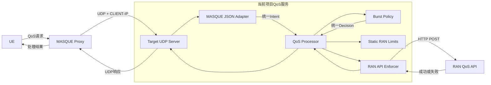

架构中最重要的边界是：

```text
外部协议 -> Intent -> Policy -> Decision -> Enforcer -> ApplyResult
```

外部协议和执行端可以变化，核心策略不需要随之变化。

---

## 5. 共享模块 adaptiveqos

`adaptiveqos` 是一个独立 Go module：

```text
github.com/acore2026/adaptive-qos
```

它不依赖：

- MASQUE协议实现
- UDP Server
- free6gc Driver
- UPF Session/PDR/QER
- PFCP
- 特定RAN配置系统

### 5.1 统一领域模型

定义位置：

```text
adaptiveqos/model.go
```

#### FlowSelector

用于标识需要应用 QoS 的目标流。

| 字段 | 类型 | 说明 |
| --- | --- | --- |
| RNTI | uint32 | 当前项目RAN侧UE标识 |
| QFI | uint8 | QoS Flow标识 |
| UEAddress | string | UE地址，仅作为辅助信息 |
| SEID | uint64 | free6gc/UPF场景的可选会话标识 |

当前项目以 `RNTI + QFI` 为主匹配字段。

#### BurstDemand

描述单个方向的突发流量需求。

| 字段 | 单位 | 说明 |
| --- | --- | --- |
| SizeKB | kB | 突发数据量 |
| DurationMS | ms | 突发持续时间 |

UL和DL分别使用独立的 `BurstDemand`，不再假设 UL 是 DL 的固定比例。

#### Intent

`Intent` 是协议无关的策略输入。

```go
type Intent struct {
    RequestID string
    Flow      FlowSelector

    ULBurst BurstDemand
    DLBurst BurstDemand

    E2EDelayMS       uint64
    ULTransitDelayMS uint64
    DLTransitDelayMS uint64
}
```

单位直接写入字段名，避免字节、kB、bps、kbps之间的混淆。

#### Limits

定义执行端支持的参数范围：

```go
type Limits struct {
    MBRUL    Range
    MBRDL    Range
    GBRUL    Range
    GBRDL    Range
    PDB      Range
    Priority Range
}
```

当前默认 RAN 范围：

| 参数 | 最小值 | 最大值 | 单位 |
| --- | ---: | ---: | --- |
| MBR UL | 0 | 4,000,000,000 | kbps |
| MBR DL | 0 | 4,000,000,000 | kbps |
| GBR UL | 0 | 100,000 | kbps |
| GBR DL | 0 | 100,000 | kbps |
| PDB | 10 | 300 | ms |
| Priority | 1 | 15 | - |

#### Decision

`Decision` 同时保存：

- 最终下发值
- 裁剪前目标值
- 实际参与 GBR 计算的 UL/DL 传输时延

这样可以在调试时区分“公式计算结果”和“接口最终下发结果”。

### 5.2 核心扩展接口

#### Policy

```go
type Policy interface {
    Generate(
        context.Context,
        Intent,
        Limits,
    ) (Decision, error)
}
```

职责：

- 校验策略输入
- 计算目标QoS
- 根据Limits裁剪
- 返回协议无关的Decision

#### LimitsProvider

```go
type LimitsProvider interface {
    Limits(
        context.Context,
        FlowSelector,
    ) (Limits, error)
}
```

当前项目使用固定 `StaticLimits`。

未来可以实现：

- 配置中心LimitsProvider
- RAN能力查询LimitsProvider
- UPF原QoS查询LimitsProvider
- 按基站或小区区分的LimitsProvider

#### Enforcer

```go
type Enforcer interface {
    Apply(
        context.Context,
        Intent,
        Decision,
    ) (ApplyResult, error)
}
```

当前项目使用 RAN HTTP Enforcer。

其他项目可以实现：

- UPF QER Enforcer
- gRPC Enforcer
- PFCP Enforcer
- 消息队列 Enforcer
- 测试用内存 Enforcer

### 5.3 Processor编排

定义位置：

```text
adaptiveqos/processor.go
```

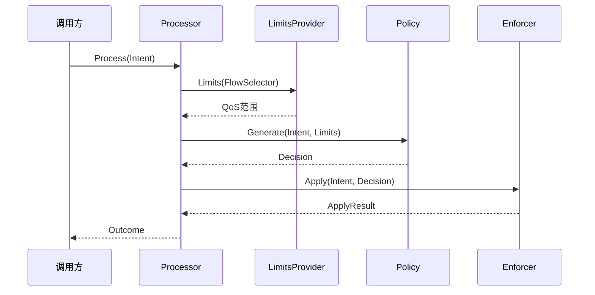

`Processor` 只负责编排，不解析 JSON，也不直接发送 HTTP。

---

## 6. 当前Burst策略

定义位置：

```text
adaptiveqos/policy.go
```

### 6.1 输入校验

强制要求：

- `rnti` 范围为 `[0,65535]`
- `qfi` 范围为 `[0,63]`
- `service_info.e2e_delay > 0`
- `ul_burst_size > 0`
- `ul_burst_duration > 0`
- `dl_burst_size` 和 `dl_burst_duration` 成对可选：同时缺失时不下发DL QoS；只携带一个或值为0时拒绝

`source_address`、UE IP、五元组和5QI不参与当前计算。

### 6.2 MBR计算

UL和DL分别计算：

```text
MBR_UL = UL_Burst_Size_KB * 8 * 1000 / UL_Burst_Duration_MS
MBR_DL = DL_Burst_Size_KB * 8 * 1000 / DL_Burst_Duration_MS
```

结果单位为 `kbps`。

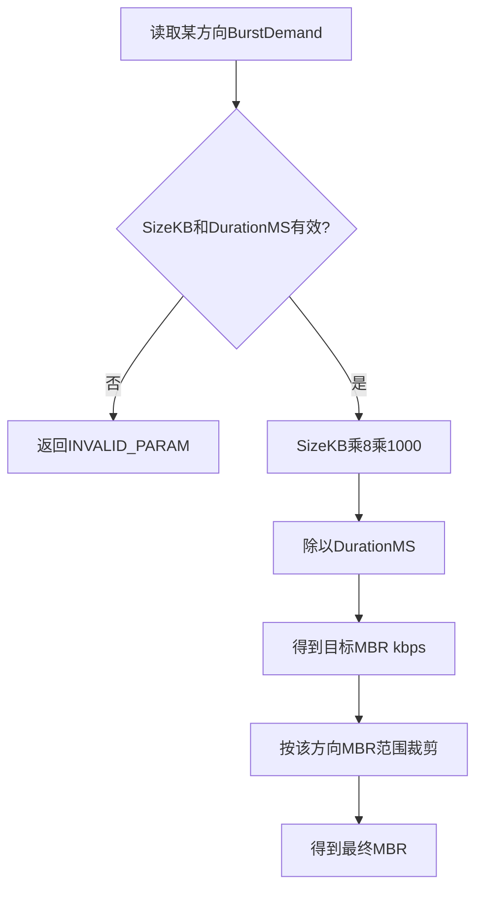

### 6.3 真实传输时延选择

GBR需要真实传输时延。当前选择顺序：

1. 使用请求中明确携带的 UL/DL 真实传输时延。
2. 如果没有明确值，使用必选的 `E2EDelay × TransitDelayRatio`。
3. 默认传输时延仅作为内部兜底配置；正常协议请求缺少 E2E 会在校验阶段被拒绝。

默认配置：

```text
TransitDelayRatio = 0.8
DefaultTransitDelay = 100 ms
```

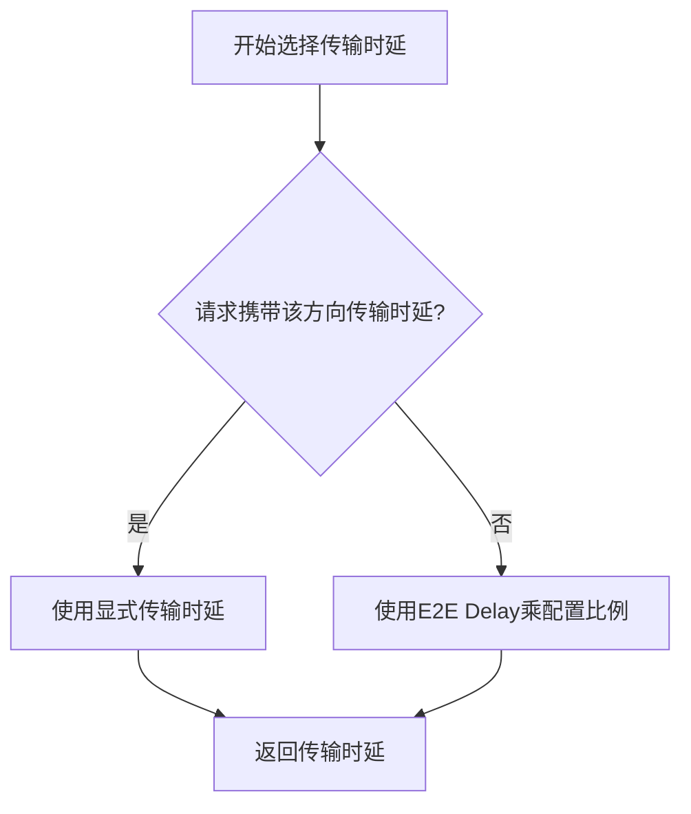

当前 MASQUE 适配器兼容以下字段名：

- `ul_transit_delay`
- `dl_transit_delay`
- `ul_transmission_delay`
- `dl_transmission_delay`
- `ul_real_transmission_delay`
- `dl_real_transmission_delay`

这些字段均按 `ms` 处理。

### 6.4 GBR计算

```text
GBR_UL = UL_Burst_Size_KB * 8 * 1000 / UL_Transit_Delay_MS
GBR_DL = DL_Burst_Size_KB * 8 * 1000 / DL_Transit_Delay_MS
```

计算完成后，UL/DL分别按 RAN GBR 范围裁剪。

### 6.5 PDB计算

```text
PDB = E2E_Delay_MS * 0.625
```

`E2E_Delay_MS` 为当前协议必选字段，缺失或为0时请求会被拒绝。PDB计算后按 `[10,300] ms` 裁剪。

### 6.6 优先级

当前业务统一为 VideoStreaming：

```text
Priority = 3
```

当前版本不做5QI重新映射。

### 6.7 设计示例

输入：

```text
UL Burst Size      = 1024 kB
UL Burst Duration  = 100 ms
DL Burst Size      = 2048 kB
DL Burst Duration  = 100 ms
E2E Delay          = 160 ms
Transit Ratio      = 0.8
```

传输时延：

```text
UL Transit Delay = 160 * 0.8 = 128 ms
DL Transit Delay = 160 * 0.8 = 128 ms
```

计算结果：

| 参数 | 目标值 | RAN裁剪后 |
| --- | ---: | ---: |
| MBR UL | 81,920 kbps | 81,920 kbps |
| MBR DL | 163,840 kbps | 163,840 kbps |
| GBR UL | 64,000 kbps | 64,000 kbps |
| GBR DL | 128,000 kbps | 100,000 kbps |
| PDB | 100 ms | 100 ms |
| Priority | 3 | 3 |

---

## 7. MASQUE请求适配器

定义位置：

```text
adaptiveqos/masqueapi/request.go
```

### 7.1 职责

该适配器负责：

1. 判断报文是否属于当前项目协议。
2. JSON反序列化。
3. 校验当前协议的必选字段。
4. 将外部结构转换成统一 `Intent`。
5. 使用 Proxy 的 `CLIENT-IP` 补充辅助 UE 地址。
6. 生成本地错误反馈。

### 7.2 协议识别

当 JSON 同时出现以下主字段时，才认为它可能属于当前项目：

```text
request_id
rnti
qfi
burst_info
```

这样可以避免将原 free6gc `AdaptiveReport` 或其他只携带 `request_id` 的消息错误识别成当前项目请求。

### 7.3 当前请求示例

```json
{
  "request_id": "req-flexible-qos-20260721-001",
  "rnti": 11222,
  "qfi": 1,
  "source_address": "192.168.1.100",
  "burst_info": {
    "ul_burst_size": 1024,
    "ul_burst_duration": 100,
    "dl_burst_size": 2048,
    "dl_burst_duration": 100,
    "arrive_time_to_next_burst": 50
  },
  "service_info": {
    "service_type": "VideoStreaming",
    "e2e_delay": 160
  }
}
```

### 7.4 协议与领域模型转换

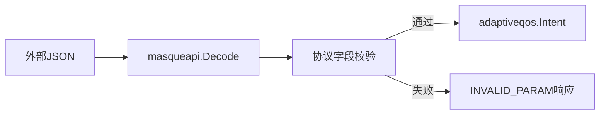

协议字段变化应集中在该适配器处理，不应直接修改核心策略。

---

## 8. RAN API适配器

定义位置：

```text
adaptiveqos/ranapi/client.go
```

### 8.1 职责

RAN适配器实现 `Enforcer`：

1. 将 `Intent + Decision` 转换为 RAN 请求。
2. 填充 RAN 接口默认参数。
3. 发起 HTTP POST。
4. 读取 RAN 成功或失败响应。
5. 将 RAN 原始响应保存在 `ApplyResult.RawResponse`。

保留原始响应的目的是降低 QoS 模块对返回消息格式的耦合。

### 8.2 主要字段映射

| 统一模型 | RAN字段 | 说明 |
| --- | --- | --- |
| Intent.RequestID | request_id | 请求标识 |
| Intent.Flow.RNTI | rnti | UE标识 |
| Intent.Flow.QFI | q_qfi | QoS Flow标识 |
| Decision.MBRDLKbps | q_mbr_dl | 下行MBR |
| Decision.MBRULKbps | q_mbr_ul | 上行MBR |
| Decision.GBRDLKbps | q_gbr_dl | 下行GBR |
| Decision.GBRULKbps | q_gbr_ul | 上行GBR |
| Decision.PDBMS | q_pdb | PDB |
| Decision.Priority | q_pri | QoS优先级 |
| Decision.Priority | q_lvl | 优先级等级 |

### 8.3 默认RAN字段

| 字段 | 默认值 |
| --- | ---: |
| mask | 默认按实际下发JSON字段自动生成；可手动覆盖 |
| q_type | 0 |
| q_cap | 1 |
| q_vul | 0 |
| dl_max_mcs | 28 |
| ul_max_mcs | 28 |
| dl_max_rb | 273 |
| ul_max_rb | 273 |
| ul_bler_upper | 0.01 |
| dl_bler_upper | 0.01 |
| ul_smooth | 0.5 |
| dl_smooth | 0.5 |

### 8.4 RAN调用

默认接口：

```text
POST /api/v1/qos/update
Content-Type: application/json
```

RAN返回非2xx状态时，只要存在响应体，也会作为有效的“RAN拒绝结果”返回给上游；
只有连接失败、超时或响应读取失败才作为本地执行错误处理。

---

## 9. 当前项目Target服务

目录：

```text
target/target/
```

### 9.1 UDP Server

定义位置：

```text
target/target/server.go
```

职责：

- 绑定 UDP 地址
- 循环读取 UDP Datagram
- 解析 Proxy 添加的 `CLIENT-IP` 头
- 调用可注入的 `Handler`
- 将处理结果写回本次 `recvfrom` 的来源地址
- 支持多个 Proxy 后端源地址

UDP负载格式：

```text
CLIENT-IP: <client_ip>\r\n
\r\n
<original JSON payload>
```

`Handler` 接口：

```go
type Handler interface {
    Handle(context.Context, Message) ([]byte, error)
}
```

如果没有配置 Handler，Server 保留原 echo 行为。

### 9.2 QoSHandler

定义位置：

```text
target/target/qos_handler.go
```

`QoSHandler` 组合以下组件：

```text
masqueapi.Decode
    +
BurstPolicy
    +
Static RAN Limits
    +
ranapi.Client
```

### 9.3 当前项目完整时序

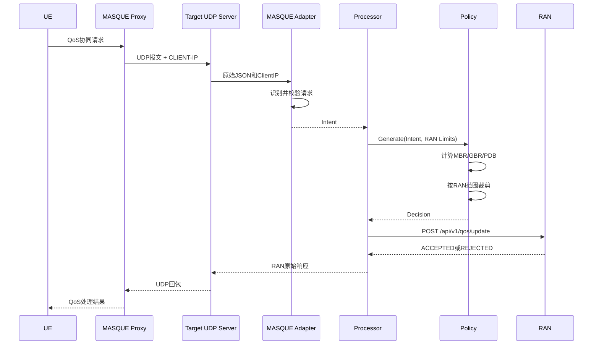

### 9.4 真实代码调用与设计流程对应

独立 `target` 路径是设计文档中“QoS模块接收MASQUE Proxy消息、计算QoS、下发RAN、返回结果”的直接实现。
真实调用顺序如下：

```text
cmd/target/main.go:main
  -> target.NewQoSHandler
  -> target.NewServer
  -> Server.Serve
  -> UDPConn.ReadFromUDP
  -> parseClientIPPayload
  -> QoSHandler.Handle
  -> masqueapi.Decode
  -> Request.Validate
  -> Request.Intent
  -> Processor.Process
  -> StaticLimits.Limits
  -> BurstPolicy.Generate
  -> ranapi.Client.Apply
  -> ranapi.BuildRequest
  -> http.Client.Do
  -> Server.WriteToUDP
```

| 设计流程节点 | 当前代码入口 | 主要输入 | 主要输出 | 说明 |
| --- | --- | --- | --- | --- |
| 启动QoS模块 | `cmd/target/main.go:main` | CLI参数：监听地址、RAN地址、时延默认值 | `Server`和`QoSHandler` | 独立Target默认监听`0.0.0.0:7400` |
| 接收MASQUE Proxy消息 | `target/target/server.go:Server.Serve` | UDP payload | `Message{ClientIP, Payload}` | 这里看到的是MASQUE Proxy转发后的普通UDP报文 |
| 提取辅助UE地址 | `parseClientIPPayload` | `CLIENT-IP: ...\r\n\r\n`可选前缀 | `Message.ClientIP` | 只作为辅助；`rnti/qfi`必须由JSON直接携带 |
| 进入QoS业务处理 | `target/target/qos_handler.go:QoSHandler.Handle` | `Message.Payload` | RAN原始响应或错误反馈 | 负责错误码映射和回包选择 |
| 识别当前项目协议 | `adaptiveqos/masqueapi/request.go:Decode` | MASQUE QoS JSON | `masqueapi.Request` | 不识别时返回`recognized=false` |
| 校验必填字段 | `Request.Validate` | `request_id/rnti/qfi/burst_info/service_info.e2e_delay` | error或通过 | UL burst和e2e_delay必填；DL burst成对可选，部分携带或为0时拒绝 |
| 转换统一意图 | `Request.Intent` | 协议字段 | `adaptiveqos.Intent` | 策略层不直接依赖JSON字段名 |
| 编排策略和执行 | `adaptiveqos/processor.go:Processor.Process` | `Intent` | `Outcome` | 先取Limits，再算Decision，最后下发 |
| 获取裁剪范围 | `StaticLimits.Limits` | `FlowSelector` | `Limits` | 当前不查询现有QoS，使用固定RAN限制 |
| 生成QoS策略 | `adaptiveqos/policy.go:BurstPolicy.Generate` | `Intent + Limits` | `Decision` | 计算MBR/GBR/PDB/Priority并裁剪 |
| 构造RAN请求 | `adaptiveqos/ranapi/client.go:BuildRequest` | `Intent + Decision` | RAN API JSON结构 | `qfi`映射为`q_qfi`，QoS值映射为`q_mbr/q_gbr/q_pdb`，`mask`默认按实际JSON字段自动生成 |
| 下发RAN | `ranapi.Client.Apply` | RAN请求JSON | `ApplyResult` | HTTP POST `/api/v1/qos/update` |
| 返回MASQUE Proxy | `Server.WriteToUDP` | `RawResponse` | UDP响应 | 当前把RAN原始响应回给MASQUE Proxy |

对应的设计到代码关系可以概括为：

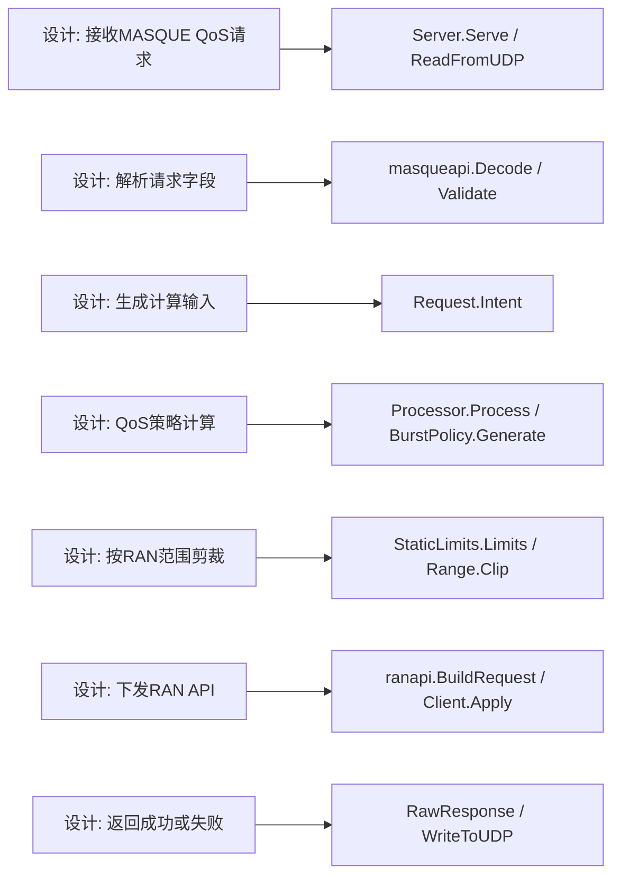

### 9.5 运行模式

QoS模式：

```bash
cd target/target

go run ./cmd/target \
  -mode qos \
  -b 0.0.0.0:7400 \
  -ran-url http://127.0.0.1:8080/api/v1/qos/update
```

Echo模式：

```bash
go run ./cmd/target \
  -mode echo \
  -prefix "reply: "
```

### 9.6 命令行参数

| 参数 | 默认值 | 说明 |
| --- | --- | --- |
| `-mode` | `qos` | `qos`或`echo` |
| `-b` | `0.0.0.0:7400` | UDP监听地址 |
| `-ran-url` | `http://127.0.0.1:8080/api/v1/qos/update` | RAN接口 |
| `-ran-timeout` | `3s` | RAN请求超时 |
| `-transit-ratio` | `0.8` | E2E到真实传输时延比例 |
| `-default-transit-delay` | `100ms` | 默认真实传输时延 |
| `-buf` | `65536` | UDP读取缓冲区 |
| `-quiet` | `false` | 是否关闭请求日志 |

---

## 10. free6gc兼容实现

### 10.1 原有功能

原控制器：

```text
ref/free6gc/free6gc-upf/internal/forwarder/userspace/adaptive_qos.go
```

原功能包括：

- 启动 MASQUE CONNECT-UDP/HTTP3入口
- 启动本地 UDP report接收器
- 解析 `AdaptiveReport`
- 根据 SEID或UE地址查找UPF Session
- 选择 AdaptiveProfile
- 写入 `AdaptiveQEROverride`
- 影响UPF userspace datapath的Gate和MBR
- 自动结束Flow并清理Override
- Debug HTTP接口
- Trace与Counter
- 返回 `AdaptiveFeedback`

### 10.2 原流程

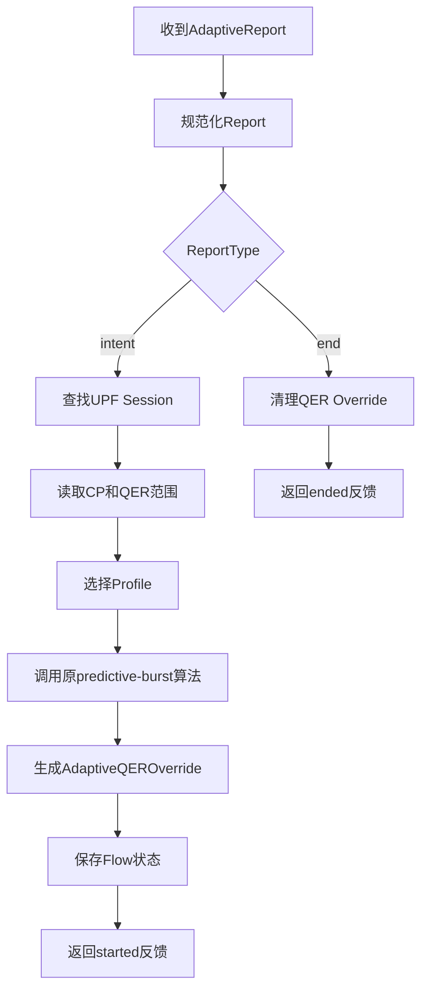

### 10.3 原predictive-burst策略

原 predictive-burst 数学逻辑继续保留在 free6gc 的 `adaptive_qos.go` 中，
没有移动到共享模块，也没有修改原函数入口和计算实现。

保留的原算法特点：

- 输入只有一个 `BurstSize`
- DL根据Burst计算
- UL默认根据DL推导
- GFBR为MBR的75%
- 使用UPF授权范围裁剪
- 输出用于QER Override

该算法与当前项目的 UL/DL 独立计算策略明确隔离。

### 10.4 当前项目兼容路径

新增适配文件：

```text
ref/free6gc/free6gc-upf/internal/forwarder/userspace/adaptive_qos_project.go
```

当 `adaptiveQos.projectRanQos.enable` 显式配置为 `true`，且 UDP report 中同时出现当前项目主字段时：

```text
request_id / rnti / qfi / burst_info
```

控制器改走当前项目共享策略和 RAN API。

### 10.5 协议分流

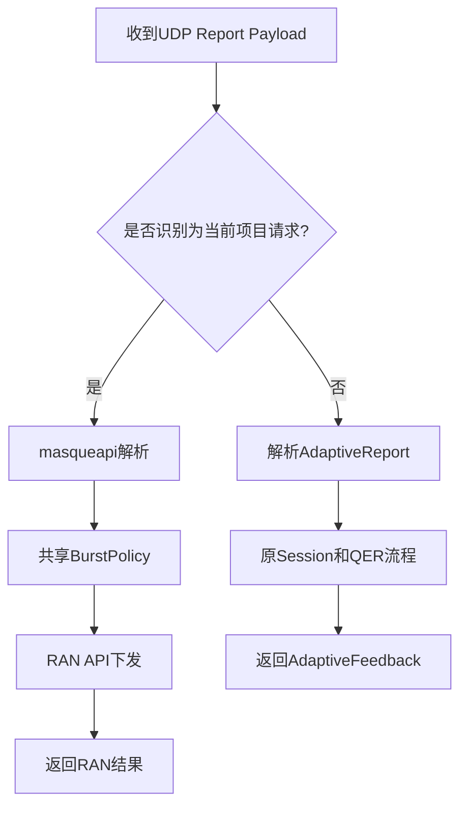

### 10.6 free6gc内嵌真实调用链

free6gc内嵌路径不是独立监听普通Target端口，而是复用原 `adaptive_qos.go` 中的 MASQUE CONNECT-UDP 和 report UDP 框架。
当前项目只在 `reportLoop` 中增加项目协议分流，命中后调用共享 `adaptiveqos` 模块。

真实调用顺序如下：

```text
userspace.New
  -> newAdaptiveQoSController
  -> adaptiveQoSController.start
  -> http3.Server.Serve(masqueLn)
  -> handleMASQUE
  -> masque.ParseRequest
  -> net.DialUDP(... reportLn.LocalAddr())
  -> masque.Proxy.ProxyConnectedSocket
  -> reportLoop
  -> reportLn.ReadFromUDP
  -> handleProjectQoSDatagram
  -> processProjectQoSPayload
  -> masqueapi.Decode
  -> Request.Validate
  -> Request.Intent
  -> Processor.Process
  -> StaticLimits.Limits
  -> BurstPolicy.Generate
  -> ranapi.Client.Apply
  -> ranapi.BuildRequest
  -> http.Client.Do
  -> traceProjectQoS
  -> reportLn.WriteToUDP
```

| 设计/运行节点 | free6gc代码入口 | 是否新增 | 说明 |
| --- | --- | --- | --- |
| 创建UPF userspace驱动 | `driver.go:New` | 否 | 原初始化流程中创建`adaptiveQoS`控制器 |
| 启动MASQUE服务 | `adaptive_qos.go:start` | 否 | 创建`masqueLn`、`reportLn`和HTTP/3 server |
| 接入CONNECT-UDP | `adaptive_qos.go:handleMASQUE` | 否 | `masque.ParseRequest`解析连接请求 |
| MASQUE转本地UDP | `ProxyConnectedSocket` | 否 | `masque-go`把datagram转到连接`reportLn`的UDP socket |
| 读取report报文 | `adaptive_qos.go:reportLoop` | 小改 | 在原循环中先调用`handleProjectQoSDatagram` |
| 项目协议分流 | `adaptive_qos_project.go:handleProjectQoSDatagram` | 新增 | 仅在`projectRanQos.enable=true`时识别；命中当前项目JSON则接管处理并回包 |
| 项目QoS处理 | `processProjectQoSPayload` | 新增 | 解析、生成策略、下发RAN、生成Trace |
| 共享策略生成 | `adaptiveqos/policy.go:BurstPolicy.Generate` | 外部共享 | 与独立Target使用同一套计算逻辑 |
| RAN下发 | `ranapi.Client.Apply` | 外部共享 | 根据`gnbControl`拼出RAN地址 |
| 原free6gc逻辑回退 | `applyAdaptiveReport` | 否 | 非项目JSON继续走原AdaptiveReport、Session、QER Override流程 |

这条路径与设计文档的关系是：

- 接收MASQUE消息：由原 `adaptive_qos.go`、HTTP/3 server和 `masque-go` 完成。
- 识别当前项目请求：由新增 `adaptive_qos_project.go` 调用 `masqueapi.Decode` 完成。
- QoS计算：仍在共享 `adaptiveqos/policy.go`，不是写在free6gc内部。
- RAN下发：仍通过共享 `ranapi.Client`。
- 回包：通过 `reportLn.WriteToUDP` 回到 `masque-go`，再返回MASQUE连接对端。
- 原有free6gc adaptive QoS：未识别为当前项目请求时继续执行，不被替换。

### 10.7 free6gc RAN配置

当前使用已有 `gnbControl` 配置：

```yaml
adaptiveQos:
  enable: true
  projectRanQos:
    enable: true
  gnbControl:
    addr: 127.0.0.1
    port: 8080
```

`projectRanQos.enable`默认关闭。不配置该开关时，free6gc只保留原有`AdaptiveReport -> Session/QER Override`流程，不会识别或处理随路QoS请求。

实际接口地址：

```text
http://127.0.0.1:8080/api/v1/qos/update
```

如果当前项目请求到达但未配置 `gnbControl`，返回：

```text
RAN_NOT_CONFIGURED
```

---

## 11. 错误处理

### 11.1 错误分类

| 错误码 | 产生位置 | 说明 |
| --- | --- | --- |
| INVALID_PARAM | MASQUE适配器或Policy | 请求缺少必选字段或范围错误 |
| LIMITS_UNAVAILABLE | Processor | 无法取得执行端参数范围 |
| RAN_UNAVAILABLE | RAN Enforcer | RAN连接失败、超时或读取失败 |
| RAN_NOT_CONFIGURED | free6gc项目适配器 | 未配置RAN地址 |
| EMPTY_RAN_RESPONSE | RAN适配器调用链 | RAN未返回响应体 |
| INTERNAL_ERROR | 本地处理 | 未分类内部错误 |

### 11.2 错误处理流程

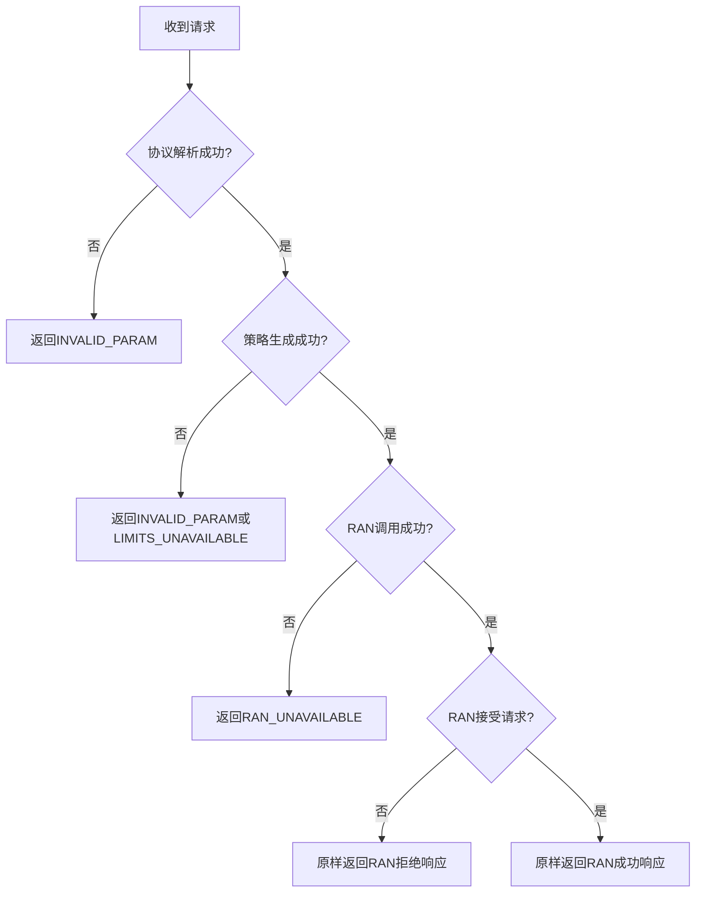

RAN明确返回的拒绝与QoS模块自身调用失败是两种不同情况：

- RAN拒绝：RAN已经处理请求，返回其原始拒绝原因。
- RAN不可用：QoS模块没有得到有效RAN处理结果，返回本地错误。

---

## 12. 测试结构

### 12.1 共享策略测试

```text
adaptiveqos/policy_test.go
```

覆盖：

- 设计文档示例数值
- UL/DL独立计算
- GBR裁剪
- PDB计算
- 固定优先级
- 显式真实传输时延
- 缺少必选Burst参数

### 12.2 MASQUE适配器测试

```text
adaptiveqos/masqueapi/request_test.go
```

覆盖：

- 当前项目请求识别
- `CLIENT-IP`辅助地址
- Intent转换
- legacy报文不会被错误接管

### 12.3 RAN适配器测试

```text
adaptiveqos/ranapi/client_test.go
```

覆盖：

- HTTP路径
- RAN请求字段
- QoS参数映射
- RAN响应读取

### 12.4 Target测试

```text
target/target/server_test.go
target/target/qos_handler_test.go
```

覆盖：

- UDP收发
- `CLIENT-IP`解析
- 多来源地址
- 原echo模式
- 当前QoS策略生成
- RAN调用
- 非法请求不会调用RAN
- UDP到RAN再返回UDP的端到端流程

### 12.5 free6gc兼容测试

```text
ref/free6gc/free6gc-upf/internal/forwarder/userspace/
    adaptive_qos_project_test.go
    driver_test.go
```

覆盖：

- 当前项目请求走共享策略
- RAN参数与独立Target一致
- legacy报文不被新分支接管
- 原QER Override结果不变
- MASQUE隧道、Flow结束、Trace和Counter原测试继续通过

### 12.6 验证命令

共享模块：

```bash
cd adaptiveqos
go test -race ./...
go vet ./...
```

当前Target：

```bash
cd target/target
go test -race ./...
go vet ./...
```

free6gc：

```bash
cd ref/free6gc/free6gc-upf
go test ./...
go test -race ./internal/forwarder/userspace
go vet ./...
```

---

## 13. 新项目接入方法

### 13.1 请求格式不同

新增项目自己的请求适配器：

```text
projectapi/request.go
```

它只需要输出：

```go
adaptiveqos.Intent
```

不需要修改 `BurstPolicy`。

### 13.2 策略公式不同

实现新的 `Policy`：

```go
type ProjectPolicy struct{}

func (p *ProjectPolicy) Generate(
    ctx context.Context,
    intent adaptiveqos.Intent,
    limits adaptiveqos.Limits,
) (adaptiveqos.Decision, error) {
    // 项目自己的策略
}
```

然后在项目启动时注入 `Processor.Policy`。

### 13.3 参数范围来源不同

实现新的 `LimitsProvider`：

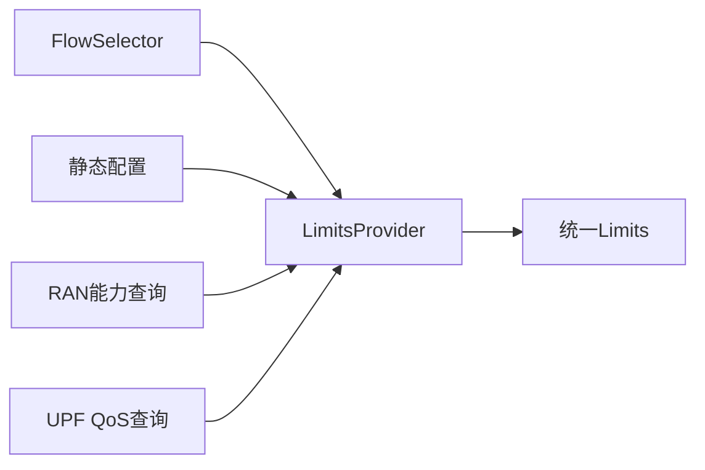

当前保留的 UPF 原QoS查询功能适合在这一层实现。

### 13.4 下发接口不同

实现新的 `Enforcer`：

```go
type ProjectEnforcer struct{}

func (e *ProjectEnforcer) Apply(
    ctx context.Context,
    intent adaptiveqos.Intent,
    decision adaptiveqos.Decision,
) (adaptiveqos.ApplyResult, error) {
    // HTTP、gRPC、PFCP或其他下发方式
}
```

### 13.5 返回格式不同

返回格式属于边缘适配层。

建议流程：

```text
ApplyResult
    -> Project Feedback Adapter
    -> 项目自己的JSON或二进制协议
```

不要在核心 `Decision` 中加入特定项目的响应字段。

---

## 14. 依赖关系约束

正确依赖方向：

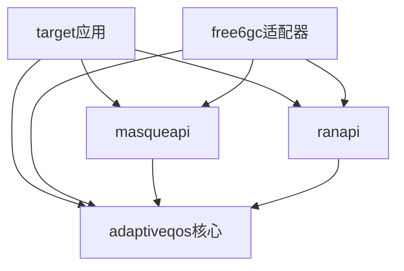

禁止的依赖方向：

- `adaptiveqos` 核心依赖 `target`
- `adaptiveqos` 核心依赖 free6gc `internal`
- Policy直接解析JSON
- Policy直接发送HTTP
- RAN适配器直接操作UPF Session
- MASQUE适配器直接计算QoS

---

## 15. 当前实现边界

### 15.1 已实现

- 当前MASQUE JSON请求
- `rnti + qfi` 主匹配字段
- UL Burst必选、DL Burst成对可选校验
- UL/DL MBR独立计算
- UL/DL GBR独立计算
- 显式或推导真实传输时延
- PDB计算
- 固定优先级3
- RAN范围裁剪
- RAN HTTP下发
- RAN原始结果UDP回送
- Target echo兼容
- free6gc legacy QER兼容
- free6gc当前项目请求兼容
- 单元、端到端、竞态和静态检查

### 15.2 当前未实现或保留

- 查询UPF原QoS并参与计算
- 5QI重新映射
- 按service_type选择不同策略
- UDP业务层重试和去重
- RAN调用重试或熔断
- 请求持久化
- 多RAN节点路由
- 鉴权和TLS配置
- 动态加载策略
- 指标导出到Prometheus

### 15.3 已知部署注意事项

当前 `target` 和 free6gc 通过本地 `replace` 引用共享模块：

```go
replace github.com/acore2026/adaptive-qos => <local path>
```

如果多个独立仓库正式共用，应：

1. 将 `adaptive-qos` 发布到独立代码仓库。
2. 创建明确版本，例如 `v0.1.0`。
3. 各项目使用固定版本依赖。
4. 删除本地 `replace`。
5. 对公共模型和接口遵循兼容性版本规则。

---

## 16. 总结

当前项目已经形成以下清晰边界：

```text
传输层
  Target UDP Server

协议适配层
  masqueapi

业务编排层
  Processor

策略层
  BurstPolicy / free6gc原有Predictive-burst Policy

资源范围层
  StaticLimits / Future UPF or RAN LimitsProvider

执行适配层
  ranapi / Future QER or PFCP Enforcer

反馈层
  RAN Raw Response / Project Feedback Adapter
```

该结构使当前项目和 free6gc 可以共享策略基础设施，同时保留不同的输入协议、
识别字段、计算规则和执行目标。后续接入其他项目时，应优先新增适配器或接口实现，
而不是在核心模块中增加项目判断。
