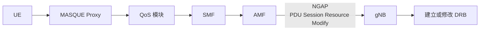
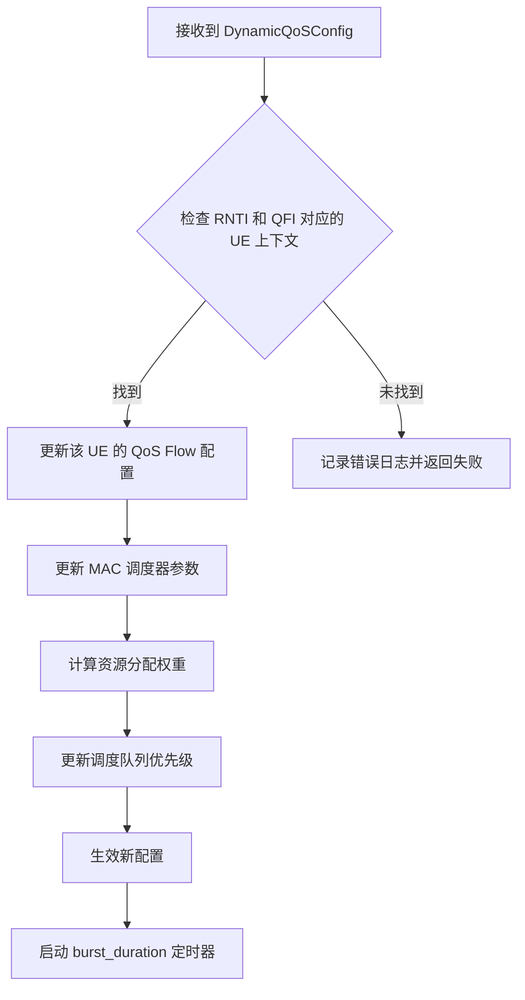
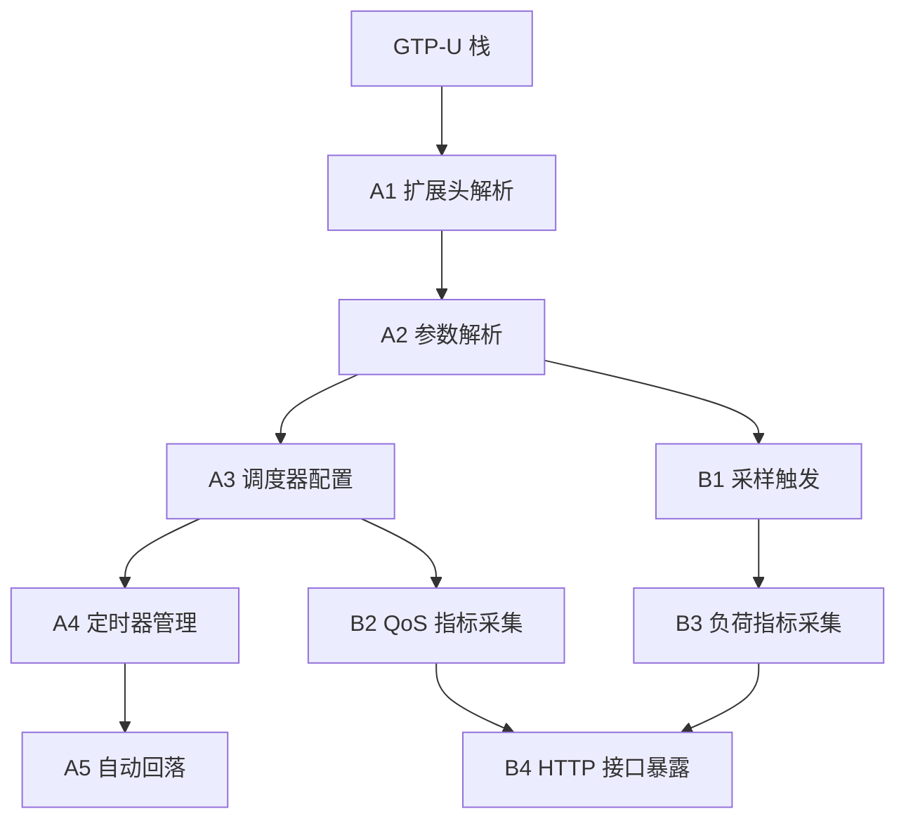

# 基站侧随路 QoS 开发需求文档

| 项目 | 内容 |
| --- | --- |
| 文档版本 | V1.0 |
| 创建日期 | 2026-08-11 |
| 关联架构 | 场景四：AI 图像实时问答（随路 QoS） |
| 参考文档 | 《上海展 6G 演示样机架构设计文档 v1.0》1.7.5 节 |

## 1. 概述

### 1.1 文档目的

本文档定义场景四（AI 图像实时问答/随路 QoS）完整流程中基站侧需要承担的功能职责，用于指导基站开发团队进行功能实现和验证。

### 1.2 背景说明

场景四的核心流程是 UE 通过 MASQUE 连接发起 QoS 协同请求，期望在上传高清图片时临时提升带宽保障。完整信令链如下：



### 1.3 基站角色定位

在随路 QoS 体系中，基站承担执行者和监测者双重角色：

| 角色 | 说明 |
| --- | --- |
| 执行者 | 接收动态 QoS 参数，建立或修改 DRB，保障业务带宽 |
| 监测者 | 采集 QoS 配置和负荷指标，上报给 WebUI，用于效果验证 |

## 2. 完整需求清单

### 2.1 功能分类总览

```text
基站侧随路 QoS 功能
├── A 类：核心功能 - QoS 保障
│   ├── A1. GTP-U 扩展头解析
│   ├── A2. 动态 QoS 参数解析
│   ├── A3. 调度器动态配置
│   ├── A4. burst_duration 定时器管理
│   └── A5. QoS 自动回落
│
├── B 类：辅助功能 - 监测上报
│   ├── B1. 10 ms 指标采样
│   ├── B2. QoS 配置指标采集
│   ├── B3. 基站负荷指标采集
│   ├── B4. HTTP 接口暴露
│   └── B5. 按 QFI 过滤统计
│
└── C 类：标准功能 - NGAP 处理
    ├── C1. PDU Session Resource Modify Request 处理
    ├── C2. DRB 建立或修改
    └── C3. PDU Session Resource Modify Response 响应
```

## 3. 当前实现状态

### 3.1 实现状态总表

| 功能编号 | 功能名称 | 实现状态 | 说明 |
| --- | --- | --- | --- |
| A1 | GTP-U 扩展头解析 | 待开发 | 需要基站支持通过 GTP-U 扩展头携带 QoS 参数 |
| A2 | 动态 QoS 参数解析 | 待开发 | 需要解析 `burst_info` 等字段 |
| A3 | 调度器动态配置 | 待开发 | 基站内部调度器需要支持运行时更新 |
| A4 | `burst_duration` 定时器管理 | 待开发 | 需要通过定时器机制触发 QoS 回落 |
| A5 | QoS 自动回落 | 待开发 | 突发结束后自动恢复默认配置 |
| B1 | 10 ms 指标采样 | 待开发 | 高频采样需要高效定时机制 |
| B2 | QoS 配置指标采集 | 待开发 | 采集 `gbr_kbps`、`q_lvl` 等指标 |
| B3 | 基站负荷指标采集 | 待开发 | 采集 PRB 利用率等指标 |
| B4 | HTTP 接口暴露 | 待开发 | 提供 `/api/v1/metrics/history` |
| B5 | 按 QFI 过滤统计 | 可选 | 根据 `qfi` 参数分别统计 |
| C1 | PDU Session Resource Modify Request 处理 | 已支持 | 标准 NGAP 功能，基站原生支持 |
| C2 | DRB 建立或修改 | 已支持 | 标准 DRB 管理，基站原生支持 |
| C3 | PDU Session Resource Modify Response 响应 | 已支持 | 标准 NGAP 响应 |

状态汇总：

- 已支持：C1、C2、C3（标准 NGAP 功能）。
- 待开发：A1-A5、B1-B4（新增功能）。
- 可选：B5（按 QFI 过滤）。

### 3.2 详细状态说明

#### 3.2.1 已实现功能（标准 NGAP）

| 功能 | 现状 | 验证结果 |
| --- | --- | --- |
| C1. PDU Session Resource Modify Request | 基站原生支持 NGAP | `gNB Handle PDUSessionResourceModifyResponse (RAN UE NGAP ID 239)` |
| C2. DRB 建立或修改 | 基站原生支持 | `l2appbh.log: RoHC disabled for DRB 5` |
| C3. PDU Session Resource Modify Response | 基站原生支持 | 返回 `Status=200` |

#### 3.2.2 待开发功能

A 类核心功能：

| 功能 | 依赖关系 | 优先级 |
| --- | --- | --- |
| A1. GTP-U 扩展头解析 | 依赖基站 GTP-U 栈支持扩展头 | P0 |
| A2. 动态 QoS 参数解析 | 依赖 A1 | P0 |
| A3. 调度器动态配置 | 依赖 A2 | P0 |
| A4. `burst_duration` 定时器 | 依赖 A3 | P1 |
| A5. QoS 自动回落 | 依赖 A4 | P1 |

B 类辅助功能：

| 功能 | 依赖关系 | 优先级 |
| --- | --- | --- |
| B1. 10 ms 指标采样 | 独立开发 | P1 |
| B2. QoS 配置指标采集 | 依赖 A3 的结果 | P1 |
| B3. 基站负荷指标采集 | 独立开发 | P2 |
| B4. HTTP 接口暴露 | 依赖 B1、B2、B3 | P1 |

## 4. 待开发需求详细说明

### 4.1 A1：GTP-U 扩展头解析

#### 功能描述

基站的 GTP-U 协议栈需要支持解析扩展头，提取其中携带的动态 QoS 参数。这是随路 QoS 方案有别于传统静态 QoS 的核心差异点。

#### 输入

```text
GTP-U Header + Extension Header

┌────────────────┬────────────────┬──────────────┬──────────────────┐
│ TEID (4 B)     │ Sequence (2 B) │ N-PDU (1 B) │ Extension Header │
│                │                │              │ 动态 QoS 参数    │
└────────────────┴────────────────┴──────────────┴──────────────────┘
```

扩展头内容（来自 QoS 模块）：

```json
{
  "request_id": "req-20231027-001",
  "mask": 4294967295,
  "rnti": 12345,
  "q_qfi": 5,
  "q_type": 0,
  "q_pri": 10,
  "q_lvl": 3,
  "q_cap": 1,
  "q_vul": 0,
  "q_pdb": 100,
  "q_mbr_dl": 1000000,
  "q_mbr_ul": 500000,
  "q_gbr_dl": 50000,
  "q_gbr_ul": 20000,
  "dl_max_mcs": 28,
  "ul_max_mcs": 28,
  "dl_max_rb": 273,
  "ul_max_rb": 273,
  "ul_bler_upper": 0.01,
  "dl_bler_upper": 0.01,
  "ul_smooth": 0.5,
  "dl_smooth": 0.5,
  "burst_info": {
    "ul_burst_size": 1024,
    "dl_burst_size": 4096,
    "ul_burst_duration": 200,
    "dl_burst_duration": 200,
    "e2e_delay_budget": 160
  }
}
```

#### 字段说明

| 字段 | 类型 | 说明 | 是否必须 |
| --- | --- | --- | --- |
| `request_id` | string | 请求唯一标识 | 是 |
| `mask` | uint32 | Bitmask，标识哪些字段有效 | 是 |
| `rnti` | uint32 | 无线网络临时标识，范围 `[0, 65535]` | 是 |
| `q_qfi` | uint8 | QoS Flow ID，范围 `[0, 63]` | 是 |
| `q_type` | uint8 | QoS 类型：`0=GBR`，`1=Non-GBR` | 否 |
| `q_pri` | uint8 | QoS 优先级，范围 `[1, 127]` | 否 |
| `q_lvl` | uint8 | 优先级 Level，范围 `[1, 15]`；`3` 表示高优先级 | 否 |
| `q_mbr_dl` | uint64 | 下行最大比特率，单位 kbps | 否 |
| `q_mbr_ul` | uint64 | 上行最大比特率，单位 kbps | 否 |
| `q_gbr_dl` | uint64 | 下行保证比特率，单位 kbps | 否 |
| `q_gbr_ul` | uint64 | 上行保证比特率，单位 kbps | 否 |
| `burst_info.ul_burst_duration` | uint64 | 上行突发持续时间，单位 ms | 是，与下行字段成对使用 |
| `burst_info.dl_burst_duration` | uint64 | 下行突发持续时间，单位 ms | 是，与上行字段成对使用 |
| `burst_info.e2e_delay_budget` | uint64 | 端到端时延预算，单位 ms | 否 |

#### 验收标准

- [ ] 基站能够正确解析 GTP-U 扩展头。
- [ ] 能够识别 Extension Header 类型。
- [ ] 能够提取所有 QoS 参数字段。
- [ ] 对无法识别的扩展头类型能够正常降级，即忽略该类型而非崩溃。

### 4.2 A2：动态 QoS 参数解析

#### 功能描述

将 GTP-U 扩展头中的 JSON 格式 QoS 参数转换为基站内部调度器可用的配置结构。

#### 内部配置结构设计

```go
type DynamicQoSConfig struct {
    RequestID     string
    RNTI          uint32
    QFI           uint8
    QoSType       QoSType // GBR or Non-GBR
    Priority      uint8
    PriorityLevel uint8

    // 资源参数
    MBRDL uint64 // kbps
    MBRUL uint64 // kbps
    GBRDL uint64 // kbps
    GBRUL uint64 // kbps

    // 调度参数
    DLMaxMCS uint8
    ULMaxMCS uint8
    DLMaxRB  uint16
    ULMaxRB  uint16

    // 链路适配
    ULBLERUpper float64
    DLBLERUpper float64
    ULSmooth    float64
    DLSmooth    float64

    // 突发参数
    BurstInfo struct {
        ULBurstSize     uint64
        DLBurstSize     uint64
        ULBurstDuration uint64 // ms
        DLBurstDuration uint64 // ms
        E2EDelayBudget  uint64 // ms
    }
}
```

#### 验收标准

- [ ] 所有参数能够正确解析。
- [ ] `mask` 字段能够正确过滤无效字段。
- [ ] 异常值能够被检测并记录日志。

### 4.3 A3：调度器动态配置

#### 功能描述

将解析后的 QoS 参数应用到基站 MAC 调度器，实现运行时 QoS 配置更新。

#### 调度器需要修改的配置项

| 配置项 | 传统静态配置 | 动态配置 | 说明 |
| --- | --- | --- | --- |
| GBR UL | Session 建立时配置 | 可运行时更新 | 单位 kbps |
| GBR DL | Session 建立时配置 | 可运行时更新 | 单位 kbps |
| MBR UL | Session 建立时配置 | 可运行时更新 | 单位 kbps |
| MBR DL | Session 建立时配置 | 可运行时更新 | 单位 kbps |
| Priority Level | Session 建立时配置 | 可运行时更新 | 范围 `[1, 15]`，数字越小优先级越高 |
| Max MCS | 静态配置 | 可运行时更新 | 范围 `[0, 28]` |
| Max RB | 静态配置 | 可运行时更新 | 范围 `[0, 273]` |
| BLER Target | 静态配置 | 可运行时更新 | 范围 `[0, 1]` |

#### 调度器更新流程



#### 验收标准

- [ ] 配置更新后立即生效，即在下一个调度周期应用。
- [ ] 更新不影响其他 UE 的 QoS 配置。
- [ ] 能够在同一 UE 的不同 QFI 上独立应用不同配置。

### 4.4 A4：`burst_duration` 定时器管理

#### 功能描述

当 QoS 配置中携带 `burst_duration` 时，基站需要启动定时器，在指定时间后触发 QoS 回落。

#### 定时器行为

```text
T=0                         T=burst_duration
│                           │
│ 应用新 QoS 配置           │ 定时器触发并回落默认配置
│ GBR: 48 -> 5238 kbps      │ GBR: 5238 -> 48 kbps
│ q_lvl: 9 -> 3             │ q_lvl: 3 -> 9
▼                           ▼
├───────────────────────────┼──────────────────────────────>
       突发保障期间                     自动回落
```

#### 定时器参数

| 参数 | 来源 | 说明 |
| --- | --- | --- |
| `burst_duration` | GTP-U 扩展头 `burst_info.ul_burst_duration` | 上行突发持续时间，单位 ms |
| `burst_duration` | GTP-U 扩展头 `burst_info.dl_burst_duration` | 下行突发持续时间，单位 ms |

取上下行持续时间的较大值作为定时器时长。

#### 验收标准

- [ ] 定时器在 QoS 配置生效时启动。
- [ ] 定时器时长等于 `burst_duration`。
- [ ] 定时器触发后 QoS 配置能够正确回落。
- [ ] 支持同一 UE 的多个并发定时器，不同 QFI 相互独立。

### 4.5 A5：QoS 自动回落

#### 功能描述

当 `burst_duration` 定时器到期时，自动将 QoS 配置恢复为默认值。

#### 默认值定义

| 参数 | 默认值 | 说明 |
| --- | --- | --- |
| GBR UL | 48 kbps | 基础保障速率 |
| GBR DL | 48 kbps | 基础保障速率 |
| MBR UL | 不限制 | 或使用配置的上限 |
| MBR DL | 不限制 | 或使用配置的上限 |
| `q_lvl` | 9 | 默认优先级（最低） |

#### 回落流程


#### 验收标准

- [ ] 回落操作不丢包。
- [ ] 回落前后业务连续性不受影响。
- [ ] 日志记录完整，便于问题排查。

### 4.6 B1：10 ms 指标采样

#### 功能描述

基站需要高频采样当前运行状态，用于评估随路 QoS 方案的效果。

#### 采样频率

| 指标类型 | 采样频率 | 说明 |
| --- | --- | --- |
| QoS 配置指标 | 10 ms | 满足实时曲线绘制需求 |
| 基站负荷指标 | 100 ms | 负荷指标变化较慢 |

#### 采样定时机制

```go
type MetricsSampler struct {
    ticker        *time.Ticker // 10 ms
    buffer        *RingBuffer  // 采样数据缓冲
    flushInterval time.Duration
}
```

#### 验收标准

- [ ] 采样精度误差小于 1 ms。
- [ ] 高频采样不影响基站正常业务。
- [ ] 采样数据不丢帧。

### 4.7 B2：QoS 配置指标采集

#### 功能描述

采集每个 QoS Flow 的当前配置状态。

#### 采集字段

| 字段 | 类型 | 说明 |
| --- | --- | --- |
| `timestamp` | uint64 | Unix 时间戳（毫秒） |
| `gbr_kbps` | float64 | 当前 GBR 保障速率，单位 kbps |
| `q_lvl` | uint8 | 当前优先级 Level，范围 `[1, 15]` |
| `qfi` | uint8 | QoS Flow ID |

#### 数据结构

```json
{
  "timestamp": 1679450000123,
  "gbr_kbps": 5238.8,
  "q_lvl": 3,
  "qfi": 5
}
```

#### 验收标准

- [ ] 准确反映当前调度器配置。
- [ ] 能够在 QoS 切换时捕捉到变化沿。
- [ ] 支持按 QFI 分别采集。

### 4.8 B3：基站负荷指标采集

#### 功能描述

采集基站整体资源使用情况，用于评估随路 QoS 对基站负荷的影响。

#### 采集字段

| 字段 | 类型 | 说明 |
| --- | --- | --- |
| `timestamp` | uint64 | Unix 时间戳（秒） |
| `prb_utilization_dl` | float64 | 下行 PRB 利用率，范围 `[0, 100%]` |
| `prb_utilization_ul` | float64 | 上行 PRB 利用率，范围 `[0, 100%]` |
| `cpu_usage` | float64 | CPU 使用率，范围 `[0, 100%]` |
| `memory_usage` | float64 | 内存使用率，范围 `[0, 100%]` |

#### 验收标准

- [ ] 负荷指标能够区分不同 QoS 配置下的差异。
- [ ] 采集过程不影响基站性能。
- [ ] 数据能够用于“随路 QoS 与默认大 GBR”的效果对比。

### 4.9 B4：HTTP 接口暴露

#### 功能描述

基站需要提供 HTTP 接口，供 WebUI 拉取 metrics 数据进行可视化展示。

#### 接口定义

```http
GET /api/v1/metrics/history?time_window=5&qfi=1
```

| 参数 | 类型 | 说明 |
| --- | --- | --- |
| `time_window` | int | 时间窗口，单位秒，默认 5 秒 |
| `qfi` | int | QoS Flow ID 过滤条件，可选 |

响应示例：

```json
{
  "metrics": [
    {
      "timestamp": 1679450000,
      "gbr_kbps": 48.4,
      "q_lvl": 9
    },
    {
      "timestamp": 1679450010,
      "gbr_kbps": 5238.8,
      "q_lvl": 4
    }
  ]
}
```

#### 启动参数

| 参数 | 默认值 | 说明 |
| --- | --- | --- |
| `-metrics-bind` | `0.0.0.0:9090` | HTTP 监听地址 |
| `-metrics-path` | `/api/v1/metrics/history` | 查询路径 |

#### 验收标准

- [ ] HTTP 服务能够正常启动。
- [ ] 查询接口返回正确格式的 JSON。
- [ ] `time_window` 参数能够正确过滤历史数据。
- [ ] `qfi` 参数能够正确过滤不同 Flow。

### 4.10 B5：按 QFI 过滤统计（可选）

#### 功能描述

当基站服务于多个 UE、每个 UE 有多个 QoS Flow 时，需要支持按 QFI 分别统计。

#### 实现方式

- 查询参数中增加 `qfi` 过滤条件。
- 内部维护 `map[qfi]MetricsBuffer`，按 QFI 分别存储。

#### 验收标准

- [ ] 能够按指定 QFI 查询。
- [ ] 能够同时查询所有 QFI。
- [ ] 多 QFI 并发查询不影响性能。

## 5. 接口依赖关系

### 5.1 基站内部接口



### 5.2 与外部系统接口

| 接口 | 方向 | 说明 |
| --- | --- | --- |
| GTP-U + Extension Header | 输入 | 来自 UPF，携带动态 QoS 参数 |
| NGAP PDU Session Resource Modify | 输入 | 来自 AMF，执行标准 QoS 修改 |
| NGAP PDU Session Resource Modify Response | 输出 | 发送到 AMF，返回处理结果 |
| `GET /api/v1/metrics/history` | 输出 | 向 WebUI 提供 metrics 数据 |

## 6. 优先级与排期建议

### 6.1 优先级定义

| 优先级 | 说明 | 迭代 |
| --- | --- | --- |
| P0 | 必须实现，否则流程无法走通 | 迭代 1 |
| P1 | 应该实现，用于提升方案完整性 | 迭代 2 |
| P2 | 可以实现，用于增强可观测性 | 迭代 3 |
| 可选 | 增强功能，非必须 | 后续 |

### 6.2 迭代规划

#### 迭代 1：核心 QoS 保障（P0）

| 功能 | 负责人 | 工作量 | 验收时间 |
| --- | --- | --- | --- |
| A1. GTP-U 扩展头解析 | 基站开发 | 3 天 | 待定 |
| A2. 动态 QoS 参数解析 | 基站开发 | 2 天 | 待定 |
| A3. 调度器动态配置 | 基站开发 | 5 天 | 待定 |
| C1-C3. NGAP 处理 | 基站开发 | 0 天（已有） | 待定 |

迭代目标：打通端到端 QoS 下发链路，使 UE 能够获得动态带宽保障。

#### 迭代 2：定时器与回落（P1）

| 功能 | 负责人 | 工作量 | 验收时间 |
| --- | --- | --- | --- |
| A4. `burst_duration` 定时器 | 基站开发 | 2 天 | 待定 |
| A5. QoS 自动回落 | 基站开发 | 2 天 | 待定 |
| B1. 10 ms 指标采样 | 基站开发 | 2 天 | 待定 |
| B2. QoS 配置指标采集 | 基站开发 | 2 天 | 待定 |

迭代目标：突发结束后能够自动回落，并正常采集指标。

#### 迭代 3：负荷监测与上报（P2）

| 功能 | 负责人 | 工作量 | 验收时间 |
| --- | --- | --- | --- |
| B3. 基站负荷指标采集 | 基站开发 | 2 天 | 待定 |
| B4. HTTP 接口暴露 | 基站开发 | 2 天 | 待定 |
| B5. 按 QFI 过滤统计 | 基站开发 | 1 天 | 可选 |

迭代目标：WebUI 能够展示完整的监测数据。

## 7. 验收测试用例

### 7.1 核心功能测试

#### TC-001：GTP-U 扩展头解析

| 项目 | 内容 |
| --- | --- |
| 测试目的 | 验证基站能够正确解析 GTP-U 扩展头中的 QoS 参数 |
| 前置条件 | 基站正常运行，UE 已接入 |
| 测试步骤 | 1. UPF 发送带扩展头的 GTP-U 报文。<br>2. 检查基站日志解析结果。 |
| 预期结果 | 所有 QoS 参数均被正确解析，无字段丢失 |
| 通过标准 | 日志显示完整参数，无解析错误 |

#### TC-002：动态 QoS 生效

| 项目 | 内容 |
| --- | --- |
| 测试目的 | 验证调度器能够应用新的 QoS 配置 |
| 前置条件 | 基站正常运行，UE 已建立 QoS Flow |
| 测试步骤 | 1. 发送动态 QoS 请求，将 GBR 从 48 kbps 调整为 5238 kbps。<br>2. 检查调度器配置。 |
| 预期结果 | 调度器配置的 GBR 变为 5238 kbps |
| 通过标准 | 调度器配置与请求参数一致 |

#### TC-003：`burst_duration` 定时器

| 项目 | 内容 |
| --- | --- |
| 测试目的 | 验证定时器能够在正确时间触发回落 |
| 前置条件 | 动态 QoS 配置已生效 |
| 测试步骤 | 1. 发送 `burst_duration=200 ms` 的 QoS 请求。<br>2. 等待 250 ms。<br>3. 检查 QoS 配置是否回落。 |
| 预期结果 | 200 ms 后，QoS 配置恢复到默认值 |
| 通过标准 | 回落时间误差小于 10 ms |

#### TC-004：QoS 自动回落

| 项目 | 内容 |
| --- | --- |
| 测试目的 | 验证回落操作不影响业务连续性 |
| 前置条件 | 动态 QoS 配置已生效，业务正在传输 |
| 测试步骤 | 1. 建立业务并传输数据。<br>2. 触发 QoS 回落。<br>3. 检查业务是否中断。 |
| 预期结果 | 业务无丢包、无中断 |
| 通过标准 | 回落前后吞吐量平滑过渡 |

### 7.2 监测功能测试

#### TC-005：10 ms 采样精度

| 项目 | 内容 |
| --- | --- |
| 测试目的 | 验证采样频率满足 10 ms 要求 |
| 前置条件 | 基站正常运行 |
| 测试步骤 | 1. 连续触发 3 次 QoS 配置变更。<br>2. 查询采样数据的时间戳。 |
| 预期结果 | 相邻采样点时间差约为 10 ms |
| 通过标准 | 采样间隔误差小于 1 ms |

#### TC-006：HTTP 接口查询

| 项目 | 内容 |
| --- | --- |
| 测试目的 | 验证 WebUI 能够通过 HTTP 获取 metrics |
| 前置条件 | 基站 metrics 服务正常运行 |
| 测试步骤 | 1. 访问 `GET /api/v1/metrics/history?qfi=5`。<br>2. 检查返回的 JSON 格式。 |
| 预期结果 | 返回正确的 metrics 数组 |
| 通过标准 | HTTP 200，且响应为正确的 JSON 格式 |

## 8. 风险与缓解

| 风险 | 影响 | 缓解措施 |
| --- | --- | --- |
| GTP-U 扩展头支持能力不确定 | P0 | 先在实验室验证 GTP-U 栈是否支持扩展头 |
| 调度器不支持动态配置 | P0 | 评估调度器架构，确定是否需要重构 |
| 10 ms 采样影响性能 | P1 | 使用高效 RingBuffer，避免频繁内存分配 |
| 多 UE 并发定时器管理复杂 | P1 | 设计专门的定时器管理器，统一管理 |
| HTTP 接口占用业务端口 | P2 | 使用独立端口，与业务端口分离 |

## 9. 附录

### 9.1 参考文档

| 文档 | 说明 |
| --- | --- |
| 《上海展 6G 演示样机架构设计文档 v1.0》1.7.5 节 | 场景四详细流程 |
| 《QoS 模块实现进度总结》 | QoS 模块当前实现状态 |
| 《NGAP 下发改造方案》 | 基站能力分析 |

### 9.2 术语表

| 术语 | 说明 |
| --- | --- |
| GTP-U | GPRS Tunneling Protocol - User Plane |
| DRB | Data Radio Bearer |
| QFI | QoS Flow Identifier |
| 5QI | 5G QoS Indicator |
| ARP | Allocation and Retention Priority |
| GBR | Guaranteed Bit Rate |
| MBR | Maximum Bit Rate |
| PDB | Packet Delay Budget |
| PRB | Physical Resource Block |
| MASQUE | Proxy for UDP to QUIC Extension |
