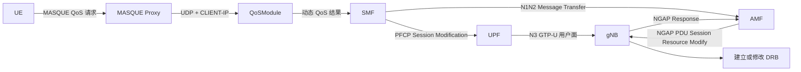
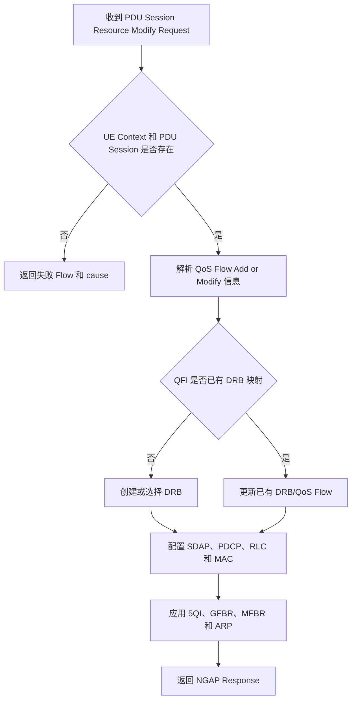

# 基站侧随路 QoS 开发需求文档

| 项目 | 内容 |
| --- | --- |
| 文档版本 | V1.1 |
| 更新日期 | 2026-08-11 |
| 适用对象 | 当前通过 free5GC 接入的封闭厂商 gNB |
| 控制路径 | SMF → AMF → NGAP → gNB |
| 依据 | 当前 QoSModule 代码、SMF 外挂验证记录和真实 gNB 日志 |

> 重要更正：当前方案不通过 GTP-U 自定义扩展头向基站传输 QoS JSON。基站不需要解析 `request_id`、`mask`、`burst_info` 或 QoSModule 的私有 HTTP 请求体，也不负责根据 `burst_duration` 启动本地回落定时器。

## 1. 文档目的

本文档定义当前随路 QoS 方案中基站侧的职责、接口、验收项和可观测性要求。目标是让基站开发团队明确哪些能力属于标准 NGAP/DRB 处理，哪些属于可选增强，避免把 QoSModule、SMF 或 UPF 的职责错误放到基站内部。

## 2. 当前架构

### 2.1 控制面与用户面



控制面 QoS 参数通过标准 NGAP/N2 SM Information 到达 gNB。N3 GTP-U 只承载用户面数据和标准 PDU Session Container/QFI 信息，不承载本项目自定义 JSON。

### 2.2 组件职责

| 组件 | 主要职责 |
| --- | --- |
| QoSModule | 接收 MASQUE 请求，计算 MBR、GBR、PDB 和优先级，调用下游 Enforcer |
| SMF | 根据 UE IP 定位 PDU Session，创建或修改 QoS Flow，更新 UPF QER，构造 N1/N2 信息 |
| UPF | 根据 PFCP PDR/QER 执行用户面分类、限速和保障 |
| AMF | 将 SMF 的 N2 SM Information 封装为 NGAP 并发送给 gNB |
| gNB | 解析 NGAP QoS Flow 参数，建立或修改 DRB，应用调度策略并返回 NGAP 响应 |

## 3. 基站侧需求总览

### 3.1 必须能力

| 编号 | 能力 | 优先级 | 当前状态 |
| --- | --- | --- | --- |
| C1 | 处理 PDU Session Resource Modify Request | P0 | 已验证支持 |
| C2 | 解析 QoS Flow Add or Modify 信息 | P0 | 已验证支持基本流程 |
| C3 | 将 QFI 映射到 DRB 并建立或修改承载 | P0 | 已验证建立 DRB 5 |
| C4 | 将 5QI、GBR/MBR、ARP 等参数应用到调度器 | P0 | 需要结合厂商日志和用户面继续验收 |
| C5 | 返回 PDU Session Resource Modify Response | P0 | 已验证支持 |
| C6 | 对失败 Flow 返回明确 NGAP cause | P0 | 待异常场景验证 |
| C7 | 支持 QoS Flow 修改或释放时更新/释放 DRB | P1 | 上游释放接口尚未实现，待联调 |

### 3.2 可观测性能力

| 编号 | 能力 | 优先级 | 说明 |
| --- | --- | --- | --- |
| O1 | NGAP 请求和响应日志 | P0 | 联调必需，不要求暴露私有 API |
| O2 | QFI、5QI、DRB 映射日志 | P0 | 用于确认 QoS Flow 是否真正落到无线承载 |
| O3 | per-UE/per-QFI 吞吐和调度指标 | P1 | 用于用户面效果验证 |
| O4 | PRB、BLER、MCS 和时延指标 | P1 | 用于比较动态 QoS 前后效果 |
| O5 | HTTP metrics 接口 | 可选 | 不是 NGAP 流程的必要条件，可由现有 OAM/遥测替代 |

### 3.3 不属于当前基站需求的能力

以下能力不应作为当前基站开发的 P0 项：

- 解析携带 QoS JSON 的自定义 GTP-U Extension Header。
- 直接接收 QoSModule 的 `POST /api/v1/qos/update`。
- 解析 `request_id`、`mask`、`rnti`、`burst_info`、MCS/RB/BLER/smooth 私有 JSON 字段。
- 根据 `burst_duration` 在基站内部启动回落定时器。
- 从 RNTI 反查 SUPI。
- 直接与 MASQUE Proxy 或 QoSModule 建立 UDP 连接。

其中 gNB HTTP API 仍可作为其他开放基站的独立适配方案，但当前厂商 BBU 已确认不提供该接口。

## 4. NGAP 处理要求

### 4.1 输入

AMF 向 gNB 发送标准 PDU Session Resource Modify Request。基站需要根据 NGAP UE Context 和 PDU Session ID 定位当前 UE，再解析 N2 SM Information 中需要增加或修改的 QoS Flow。

基站需要关注的逻辑参数包括：

| 参数 | 作用 | 基站处理要求 |
| --- | --- | --- |
| PDU Session ID | 定位 UE 的 PDU Session | 必须与现有会话匹配 |
| QFI | 标识 QoS Flow | 关联或新建对应 DRB/SDAP 映射 |
| 5QI | 选择标准 QoS 特性 | 映射到调度优先级、PDB、PER 等配置 |
| ARP | 分配和保留优先级 | 用于资源不足时的接纳和抢占判断 |
| MFBR UL/DL | 最大 Flow 比特率 | 约束该 QoS Flow 的最大速率 |
| GFBR UL/DL | 保证 Flow 比特率 | 为 GBR Flow 提供资源保障 |

QoSModule 的 `request_id` 不进入标准 NGAP。端到端关联应由 QoSModule、SMF 和 AMF 日志完成，基站侧使用 AMF UE NGAP ID、RAN UE NGAP ID、PDU Session ID 和 QFI 定位。

### 4.2 DRB 与调度器处理



调度器至少需要保证：

- 同一 UE 的不同 QFI 可以独立配置。
- 修改一个 QoS Flow 不应覆盖其他 QFI 的配置。
- 对 GBR Flow 可以保留必要资源，并受 MFBR 上限约束。
- 资源不足时应拒绝或部分接纳，并返回明确原因，不能静默按其他参数生效。
- 重复收到等价的 Modify Request 时应保持幂等，不重复创建 DRB。

### 4.3 响应

基站通过 NGAP PDU Session Resource Modify Response 返回处理结果。响应应能区分：

- 已成功增加或修改的 QoS Flow。
- 未能增加或修改的 QoS Flow。
- 失败原因，例如无线资源不足、未知 PDU Session、未知 QFI 或参数不支持。

该响应不是 HTTP JSON，不使用 `status/message/error_code`。这些字段由 QoSModule 在收到核心网结果后统一转换给 MASQUE UE。

## 5. 生命周期与回落

### 5.1 当前边界

SMF 外挂验证接口当前只支持增加或修改 QoS Flow，没有实现 release。基站也没有收到 `burst_duration`，因此不能要求基站在某个毫秒值后自行恢复默认 QoS。

### 5.2 正确方案

突发结束后，应由 QoSModule 或策略控制组件触发新的核心网操作：

```text
QoSModule 定时器到期
  -> SMF QoS release/modify 接口
  -> SMF 更新 UPF QER
  -> SMF/AMF 发送新的 PDU Session Resource Modify
  -> gNB 修改或释放 QoS Flow/DRB
```

基站侧需要支持标准的 QoS Flow 修改和释放，但不需要理解业务突发计时规则。

## 6. 当前验证结果

2026-08-07 的真实环境验证使用：

| 参数 | 值 |
| --- | --- |
| UE IP | `10.60.0.1` |
| QFI | 5 |
| 5QI | 2 |
| MBR UL | `9600000 bps` |
| MBR DL | `24000000 bps` |
| GBR UL/DL | `100000 bps` |
| ARP | 优先级 8，可抢占，不可被抢占 |

已观察到：

1. SMF 成功发送 PFCP Session Modification，UPF 返回成功。
2. AMF 接收到 N1N2 Message Transfer。
3. gNB 返回 PDU Session Resource Modify Response。
4. `l2appbh.log` 出现 `RoHC disabled for DRB 5`，确认建立 DRB 5。

该结果证明标准 NGAP/DRB 控制链已打通，但不能单凭 DRB 日志证明 GBR 在拥塞场景下达到目标。仍需要用户面性能测试。

## 7. 日志与指标要求

### 7.1 必需日志字段

建议每次 QoS 修改至少记录：

| 字段 | 用途 |
| --- | --- |
| AMF UE NGAP ID | 与 AMF 日志关联 |
| RAN UE NGAP ID | 定位 gNB UE Context |
| PDU Session ID | 定位会话 |
| QFI | 定位 QoS Flow |
| 5QI | 确认 QoS 类型 |
| DRB ID | 确认无线承载映射 |
| GFBR/MFBR UL/DL | 确认实际接收和应用的速率参数 |
| 操作类型 | add、modify 或 release |
| 结果和 cause | 定位成功、部分成功或失败 |

### 7.2 建议指标

| 指标 | 维度 | 建议采样周期 |
| --- | --- | --- |
| UL/DL throughput | UE、QFI | 100 ms 或基站现有最小周期 |
| PRB utilization | Cell、UL/DL | 100 ms |
| MCS | UE、QFI、UL/DL | 100 ms |
| BLER | UE、QFI、UL/DL | 100 ms |
| Buffer/queue delay | UE、QFI | 能力允许时采集 |

原文提出的 10 ms HTTP 采样不作为 P0 硬要求。若现有 OAM、日志或遥测接口能够提供等效数据，无需再实现独立 `/api/v1/metrics/history`。

## 8. 验收测试

### TC-001：新增 GBR QoS Flow

| 项目 | 内容 |
| --- | --- |
| 前置条件 | UE 已建立 PDU Session，默认业务可用 |
| 输入 | SMF/AMF 下发新的 QFI、5QI、GFBR、MFBR 和 ARP |
| 预期 | gNB 接纳 Flow、建立或映射 DRB，并返回成功响应 |
| 证据 | NGAP 请求/响应日志、QFI→DRB 日志 |

### TC-002：修改已有 QoS Flow

| 项目 | 内容 |
| --- | --- |
| 前置条件 | QFI 已映射到 DRB |
| 输入 | 修改同一 QFI 的 GFBR/MFBR |
| 预期 | 不重复创建 DRB，调度参数更新，其他 QFI 不受影响 |
| 证据 | 修改前后配置和吞吐指标 |

### TC-003：资源不足

| 项目 | 内容 |
| --- | --- |
| 前置条件 | 构造高负荷或不可满足的 GBR 请求 |
| 输入 | 超出可用无线资源的 QoS Flow |
| 预期 | 返回失败 Flow 和明确 cause，不影响现有业务 |
| 证据 | NGAP Response 和资源日志 |

### TC-004：QoS Flow 释放

| 项目 | 内容 |
| --- | --- |
| 前置条件 | 上游 SMF release 能力完成 |
| 输入 | 释放或恢复指定 QFI |
| 预期 | gNB 更新或释放对应 DRB，其他 Flow 保持不变 |
| 证据 | NGAP、DRB 和调度器日志 |

### TC-005：拥塞下 GBR 效果

| 项目 | 内容 |
| --- | --- |
| 前置条件 | 多 UE 产生竞争流量 |
| 输入 | 对目标视频/图片上传 Flow 启用 GBR |
| 预期 | 目标 Flow 达到可用资源范围内的 GBR，时延和丢包符合目标 |
| 证据 | per-QFI 吞吐、PRB、BLER、时延和业务体验指标 |

## 9. 已知待办

- QoSModule 尚未接入已验证的 SMF 外挂接口。
- SMF 尚未实现 QoS Flow release。
- 当前验证只发送 N2，UE 侧 N1 NAS QoS Rule 尚待补充，UL 分类需要继续验证。
- UPF 下行流量是否按新 QFI 标记尚待验证。
- gNB 已建立 DRB，但拥塞下 GBR、PDB 和视频体验仍需量化验收。

## 10. 术语

| 术语 | 说明 |
| --- | --- |
| DRB | Data Radio Bearer |
| QFI | QoS Flow Identifier |
| 5QI | 5G QoS Identifier |
| ARP | Allocation and Retention Priority |
| GFBR | Guaranteed Flow Bit Rate |
| MFBR | Maximum Flow Bit Rate |
| NGAP | NG Application Protocol |
| N2 SM Information | SMF 经 AMF 传递给 gNB 的会话管理控制信息 |
