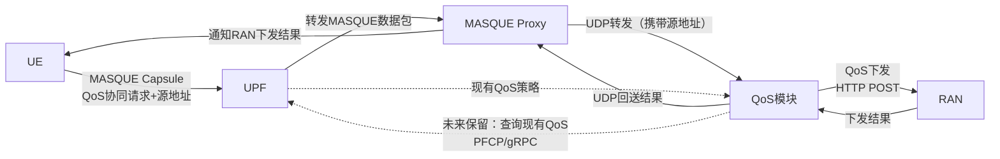
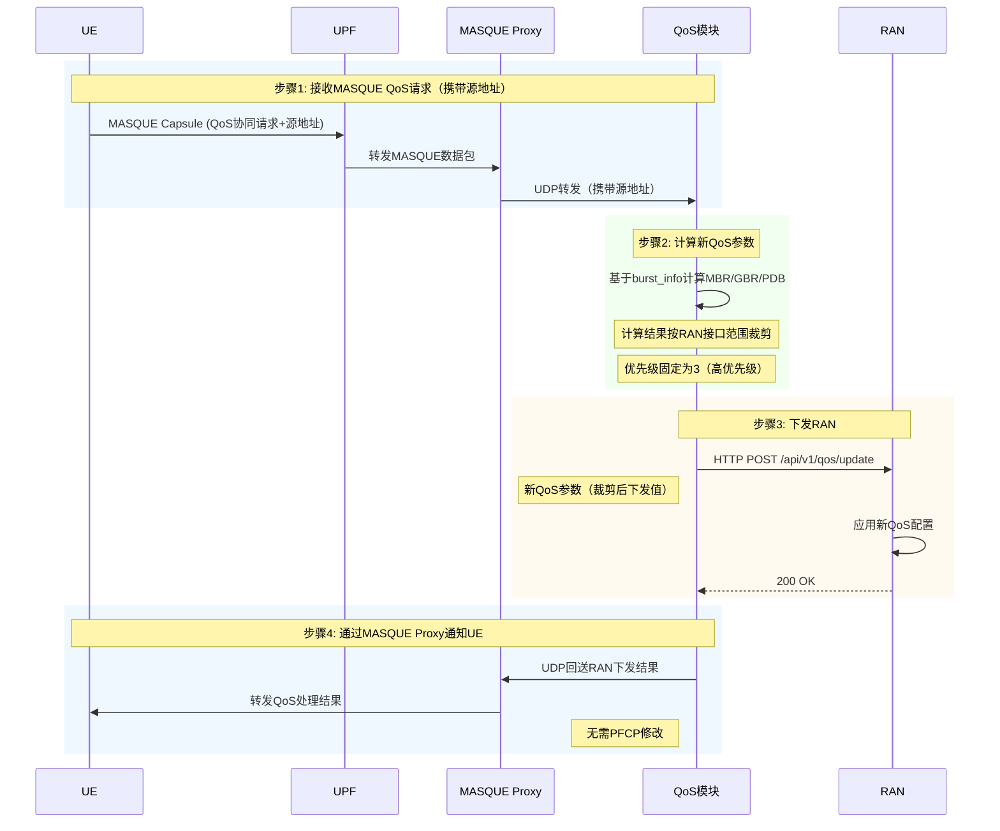
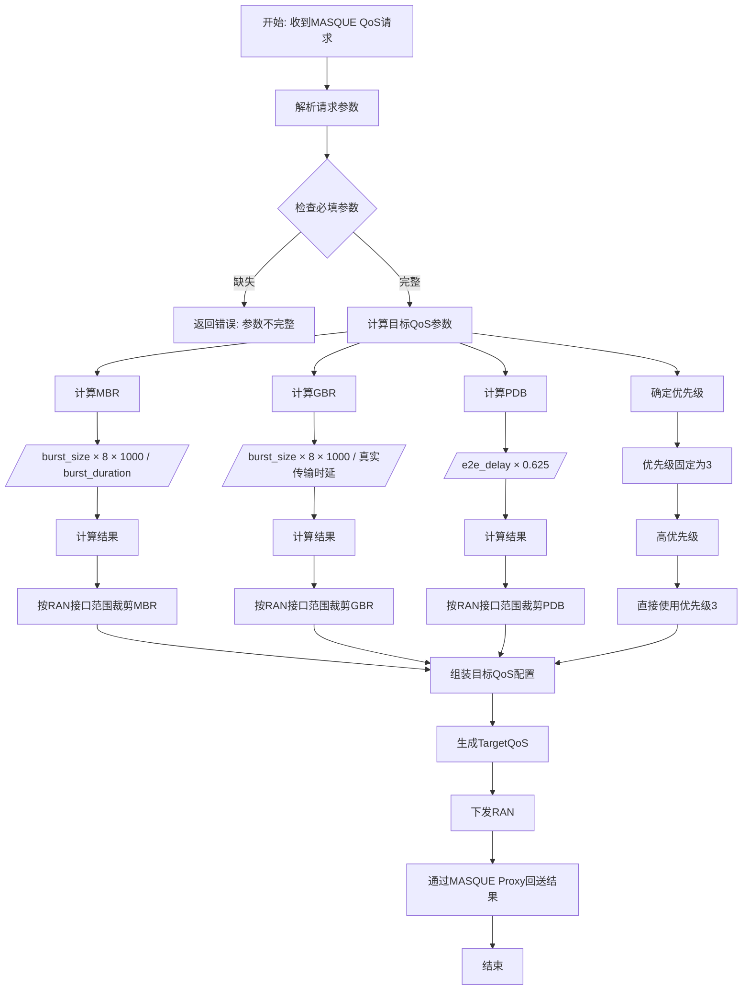
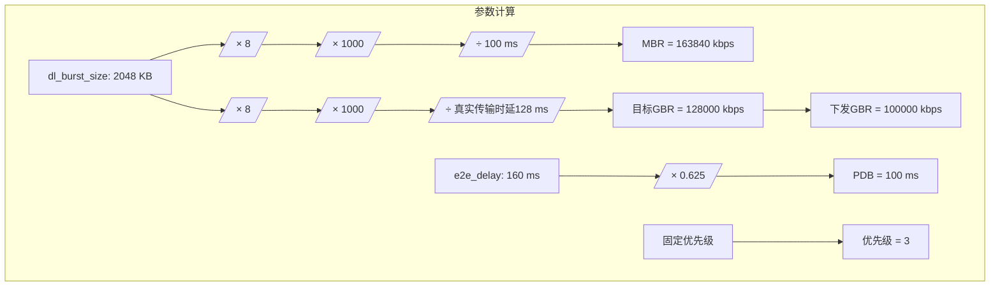
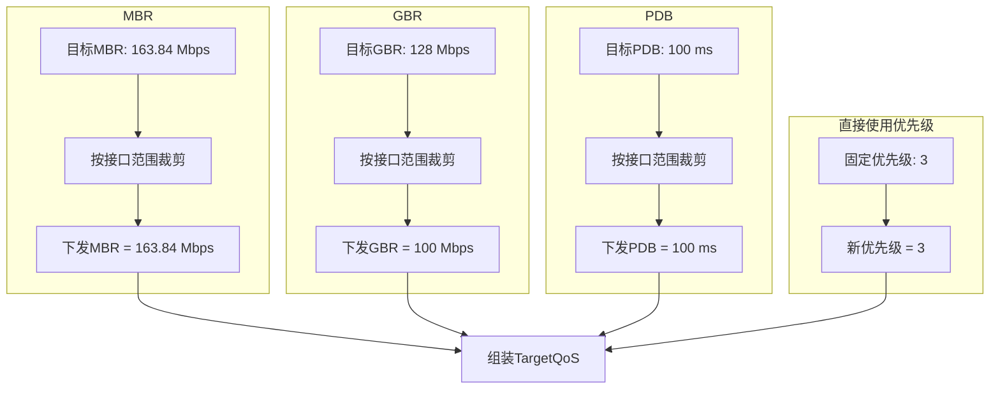
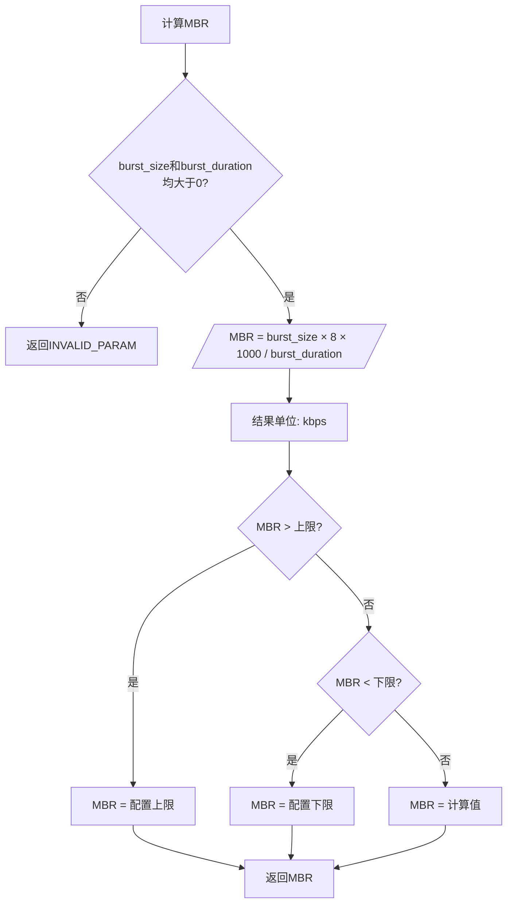
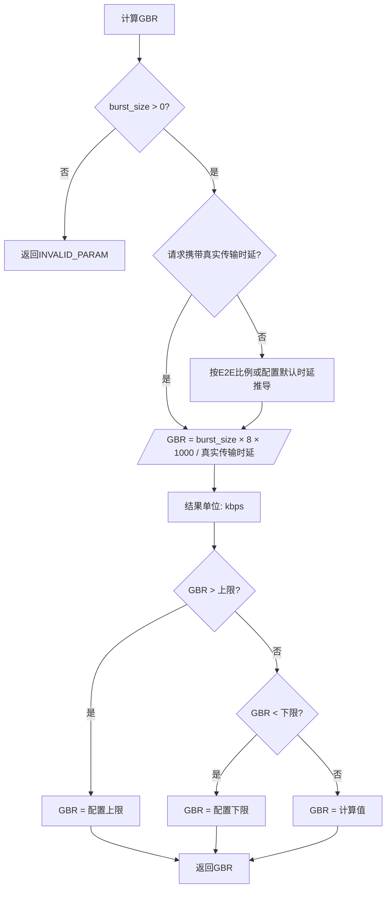
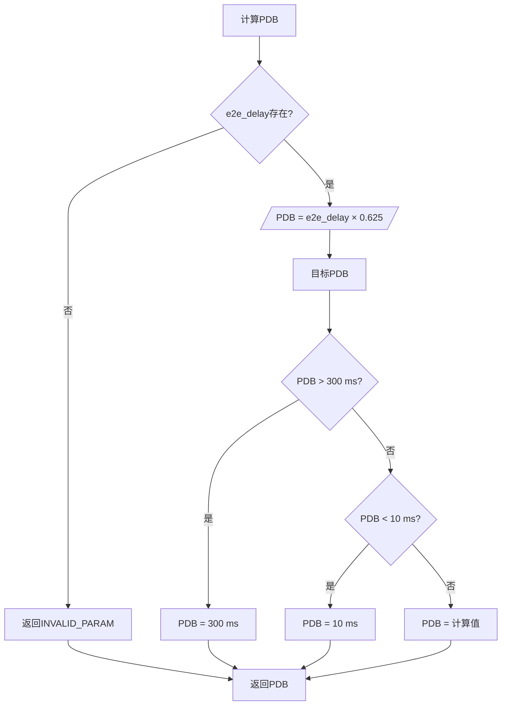
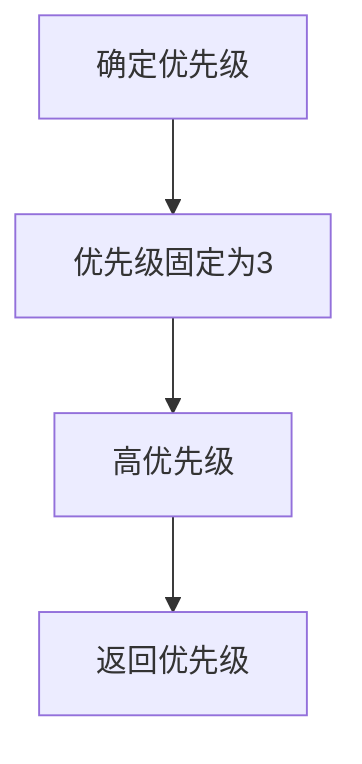
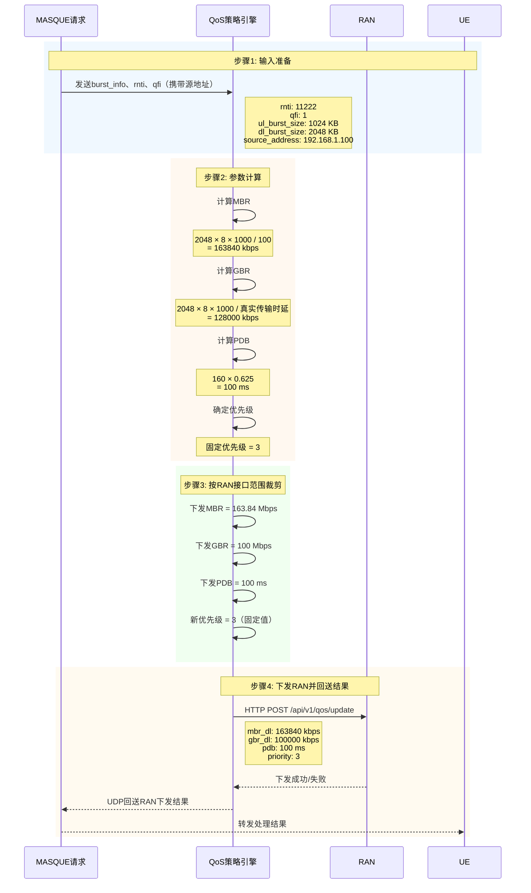

## 7.30 修改意见

1、MASQUE proxy带上源地址带给后端服务器。
2、以计算的MBR、GBR、PDB作为目标结果，按RAN接口范围裁剪后下发，用高优先级（3）。
3、当前版本不查询现有QoS、不做PFCP modify，直接向RAN下发；UPF查询作为未来保留项。
4、QoS模块通过MASQUE Proxy向UE回送RAN下发结果。
5、计算GBR时，比例按照真实的传输时延比例修改；真实传输时延来源暂作为保留项。

## 主要功能

QoS模块主要负责接收Qos协同请求的Masque消息，将携带突发参数的请求消息转化为QoS诉求，生成QoS策略并通过RAN API下发。当前版本不查询UPF现有QoS策略，也不做PFCP modify；UPF查询能力作为未来扩展保留项。

### 组网拓扑图



### 流程图



## 接收QoS协同请求Masque消息

说明：MASQUE proxy通过UDP消息携带源地址信息传递给后端服务器（QoS模块）。当前版本以`rnti`和`qfi`作为RAN下发的主匹配字段，源地址用于辅助识别、日志追踪和回送关联。由于源地址已由UDP消息提供，消息体中的五元组（packet_filter）不再必选。

```json
{
    "request_id": "req-flexible-qos-20260721-001",
    "rnti": 11222,
    "qfi": 1,
    "packet_filter": {
        "src_ip": "192.168.1.100",
        "dst_ip": "10.0.0.5",
        "src_port": 50000,
        "dst_port": 443,
        "protocol": 6
    },
    "traffic_pattern": "streaming",
    "source_address": "192.168.1.100",
    "burst_info": {
        "ul_burst_size": 1024,
        "ul_burst_duration": 100,
        "dl_burst_size": 2048,
        "dl_burst_duration": 100,
        "arrive_time_to_next_burst": 50
    },
    "service_info": {
        "service_type": "VideoStreaming",
        "frame_rate": 30,
        "max_frame_size": 150000,
        "resolution": "1920x1080",
        "code_rate": 5000,
        "e2e_delay": 160,
        "service_experience": {
            "mos_score": 4.2
        }
    }
}
```

### 对应字段说明

| 字段 | 类型 | 说明 | 是否必选 |
| --- | --- | --- | --- |
| request_id | string | 唯一请求标识 | 必选 |
| rnti | integer | 基站UE ID信息 | 必选 |
| qfi | integer | 流识别ID | 必选 |
| packet_filter | object | 数据包过滤集，如五元组 | 可选 |
| packet_filter.src_ip | string | 源IP地址 | 可选 |
| packet_filter.dst_ip | string | 目的IP地址 | 可选 |
| packet_filter.src_port | integer | 源端口 | 可选 |
| packet_filter.dst_port | integer | 目的端口 | 可选 |
| packet_filter.protocol | integer | 协议类型 | 可选 |
| traffic_pattern | string | 流量模式，如background, burst等 | 可选 |
| source_address | string | 源地址，MASQUE proxy传递给后端服务器，用于辅助识别、日志追踪和回送关联 | 可选 |
| burst_info | object | 突发数据相关信息 | 必选 |
| ul_burst_size | integer | 上行突发数据大小(e.g., 500)单位KB | 必选 |
| dl_burst_size | integer | 下行突发数据大小(e.g., 500)单位KB；与dl_burst_duration成对携带 | 可选 |
| ul_burst_duration | integer | 上行突发时长(单位: ms) | 必选 |
| dl_burst_duration | integer | 下行突发时长(单位: ms)；与dl_burst_size成对携带 | 可选 |
| arrive_time_to_next_burst | integer | 下个突发的预期到达时间(单位: ms) | 可选 |
| service_info | object | 业务大类及体验信息；必须包含e2e_delay | 必选 |
| service_type | string | 业务大类(ServiceType/AppType) | 可选 |
| frame_rate | integer | 帧率(frame) | 可选 |
| max_frame_size | integer | 最大帧长(单位: bytes) | 可选 |
| resolution | string | 分辨率(e.g., 1920x1080) | 可选 |
| code_rate | integer | 码率(单位: kbps) | 可选 |
| e2e_delay | integer | 端到端真实时延(E2E delay)，单位ms，用于PDB和真实传输时延推导 | 必选 |
| service_experience | object | 业务体验QoE，如MOS | 可选 |
| mos_score | float | MOS评分 | 可选 |
| other_metrics | object | 其他体验指标 | 可选 |

## 获取用户原QoS配置（未来保留项）

当前版本不查询用户原有QoS配置，目标QoS直接由MASQUE请求中的突发参数和业务时延预算计算得到。PFCP/gRPC接口向UPF获取用户原有QoS配置作为未来功能保留项，后续如需校验会话、补充5QI/ARP/packet_filter或参与策略合并，可启用该接口。

```json
{
  "interface": "qos_context_query",
  "transaction_id": "tx-001",
  "query_params": {
    "rnti": 11222,
    "qfi": 1,
    "ue_ip": "192.168.1.100"
  }
}
```

### 字段说明

| 字段 | 类型 | 必填 | 说明 |
| --- | --- | --- | --- |
| interface | string | 是 | 接口标识，固定qos_context_query |
| transaction_id | string | 是 | 事务ID，用于追踪和响应匹配 |
| query_params | object | 是 | 查询参数 |
| query_params.rnti | integer | 是 | 基站分配的UE标识 |
| query_params.qfi | integer | 是 | QoS Flow ID |
| query_params.ue_ip | string | 否 | UE IP地址，用于辅助匹配 |

### 获取对应的QoS响应

```json
{
  "interface": "qos_context_response",
  "transaction_id": "tx-001",
  "status": "success",
  "qos_context": {
    "session_id": "sess-abc123",
    "ue_ip": "192.168.1.100",
    "pdu_session_id": 5,
    "qfi": 1,
    "five_qi": 7,
    "qos_profile": {
      "mbr_dl": 50000,
      "mbr_ul": 25000,
      "gbr_dl": 20000,
      "gbr_ul": 10000,
      "pdb": 100,
      "plr": 0.0001
    },
    "arp": {
      "priority_level": 9,
      "preemption_capability": 1,
      "preemption_vulnerability": 0
    },
    "packet_filters": [
      {
        "filter_id": 1,
        "direction": "downlink",
        "protocol": 6,
        "src_ip": "10.0.0.0/24",
        "dst_ip": "192.168.1.100/32",
        "src_port": "*",
        "dst_port": 443
      }
    ],
    "teid": "teid-123456"
  }
}
```

### 字段说明

| 字段 | 类型 | 说明 |
| --- | --- | --- |
| status | string | 查询结果: success / not_found / error |
| qos_context | object | QoS上下文 (成功时返回) |
| qos_context.session_id | string | PFCP Session ID |
| qos_context.ue_ip | string | UE IP地址 |
| qos_context.pdu_session_id | integer | PDU Session ID |
| qos_context.qfi | integer | QoS Flow ID |
| qos_context.five_qi | integer | 5G QoS Identifier |
| qos_profile | object | 当前QoS配置 |
| qos_profile.mbr_dl | integer | 下行最大比特率，单位: kbps |
| qos_profile.mbr_ul | integer | 上行最大比特率，单位: kbps |
| qos_profile.gbr_dl | integer | 下行保证比特率，单位: kbps |
| qos_profile.gbr_ul | integer | 上行保证比特率，单位: kbps |
| qos_profile.pdb | integer | Packet Delay Budget，单位: ms |
| qos_profile.plr | float | Packet Loss Rate |
| arp | object | 分配保留优先级 |
| arp.priority_level | integer | 优先级 (1最高, 15最低) |
| arp.preemption_capability | integer | 抢占能力 (0/1) |
| arp.preemption_vulnerability | integer | 被抢占脆弱性 (0/1) |
| packet_filters | array | 数据包过滤规则列表 |
| teid | string | GTP-U Tunnel Endpoint ID |

### 错误响应

```json
{
  "interface": "qos_context_response",
  "transaction_id": "tx-001",
  "status": "error",
  "error_code": "SESSION_NOT_FOUND",
  "error_message": "No active QoS context for rnti=11222, qfi=1"
}
```

### 错误码说明

| 错误码 (error_code) | 说明 |
| --- | --- |
| SESSION_NOT_FOUND | 找不到对应的QoS会话 |
| INVALID_PARAM | 请求参数无效 |
| UPF_INTERNAL_ERROR | UPF内部错误 |
| TIMEOUT | 查询超时 |

## 动态QoS生成

动态QoS生成基于MASQUE协同请求中的突发参数和业务时延预算。当前版本不依赖UPF现有QoS配置，UPF查询仅作为未来保留项。



### 流程分步

#### 输入准备

收到MASQUE请求，提取以下关键信息:

- burst_info (突发数据信息)
  - ul_burst_size: 1024 KB
  - ul_burst_duration: 100 ms
  - dl_burst_size: 2048 KB
  - dl_burst_duration: 100 ms
- service_info (业务服务信息)
  - service_type: "VideoStreaming"
  - e2e_delay: 160 ms

当前版本要求上行突发参数和`service_info.e2e_delay`必须携带；下行突发参数为成对可选字段。若`dl_burst_size`和`dl_burst_duration`同时缺失，则本次只计算和下发UL相关QoS字段，不下发DL MBR/GBR、DL无线控制字段和DL burst信息；若只携带其中一个或携带值为0，则返回`INVALID_PARAM`。`rnti`和`qfi`必须由MASQUE请求直接携带，用于RAN下发匹配；`source_address`/`ue_ip`只作为辅助信息，用于日志追踪、回送关联和未来扩展。UPF现有QoS策略查询作为保留项，不参与当前计算。

#### 参数计算



#### 裁剪后使用计算结果



MBR、GBR、PDB均采用“先计算目标值，再按RAN接口字段范围裁剪，最后下发”的规则。当前RAN接口中GBR上限为100000 kbps，因此示例中的128000 kbps需要裁剪为100000 kbps后下发。

### MBR计算

MBR按方向分别计算：`mbr_ul = ul_burst_size × 8 × 1000 / ul_burst_duration`。当请求同时携带`dl_burst_size`和`dl_burst_duration`时，计算`mbr_dl = dl_burst_size × 8 × 1000 / dl_burst_duration`；当两个DL字段同时缺失时，不计算也不下发DL MBR。UL Burst字段必须存在且大于0；DL字段如携带则必须成对存在且大于0，否则返回`INVALID_PARAM`，不使用默认MBR。计算结果按RAN接口范围裁剪后下发。



### GBR计算

GBR按方向分别计算：`gbr_ul = ul_burst_size × 8 × 1000 / 上行真实传输时延`。当请求同时携带`dl_burst_size`和`dl_burst_duration`时，计算`gbr_dl = dl_burst_size × 8 × 1000 / 下行真实传输时延`；当两个DL字段同时缺失时，不计算也不下发DL GBR。UL Burst字段和`service_info.e2e_delay`必须存在且大于0；DL字段如携带则必须成对存在且大于0，否则返回`INVALID_PARAM`，不使用默认GBR。真实传输时延未携带不属于Burst字段缺失，仍按E2E比例推导。计算结果按RAN接口范围裁剪后下发。



真实传输时延暂作为保留/可配置输入。当前规则为：优先使用请求中携带的真实传输时延；如请求未携带，则使用配置的默认比例或默认值推导。具体字段名称和默认比例可随后续协议调整。

### PDB计算



当前版本中`service_info.e2e_delay`为必选字段；若缺失或为0，QoS模块直接返回`INVALID_PARAM`，不会使用默认PDB参与计算。默认PDB仅保留为策略配置兜底项，不应出现在当前MASQUE请求正常处理路径中。

### 优先级



#### 优先级说明

- 数值越小，优先级越高
- 1 = Voice (最高优先级，时延最敏感)
- 2 = InteractiveGaming (游戏，需要快速响应)
- 3 = VideoStreaming (本场景，动态QoS主要用途)
- 4 = VideoConference
- 6 = WebBrowsing
- 9 = Background (最低优先级)

### 5QI处理

当前版本不做5QI重新映射或修改。5QI作为可选保留字段；本次业务场景统一为VideoStreaming，因此QoS计算和RAN下发主要基于`burst_info`与`e2e_delay`，不依赖`service_type`到5QI的映射。

## 四、数据流时序图



## QoS下发

调用RAN的命令下发API进行Qos更新，协议封装遵循API要求，主体信元如下。

### RAN QoS更新请求

```json
{
  "request_id": "req-flexible-qos-20260721-001",
  "mask": 2147478187,
  "rnti": 11222,
  "q_qfi": 1,
  "q_type": 0,
  "q_pri": 3,
  "q_lvl": 3,
  "q_cap": 1,
  "q_vul": 0,
  "q_pdb": 100,
  "q_mbr_dl": 163840,
  "q_mbr_ul": 81920,
  "q_gbr_dl": 100000,
  "q_gbr_ul": 64000,
  "dl_max_mcs": 28,
  "ul_max_mcs": 28,
  "dl_max_rb": 273,
  "ul_max_rb": 273,
  "ul_bler_upper": 0.01,
  "dl_bler_upper": 0.01,
  "ul_smooth": 0.5,
  "dl_smooth": 0.5,
  "burst_info": {
    "ul_burst_size": 1024,
    "dl_burst_size": 2048,
    "ul_burst_duration": 100,
    "dl_burst_duration": 100,
    "e2e_delay_budget": 160
  }
}
```

上述RAN下发示例包含完整UL和DL字段，因此`mask`按当前字段顺序规则计算为`2147478187`。若请求只携带UL burst，DL相关字段不下发，对应bit不置1，示例规则下`mask`为`1475060385`。

### 字段说明

字段说明：当前版本向RAN下发详细QoS规则。目标QoS参数先由MASQUE请求计算得到，再按以下RAN接口字段范围裁剪。

| 参数名称 | 接口参数名称 | 类型 | 范围 | 属性 | 备注 |
| --- | --- | --- | --- | --- | --- |
| REQUEST ID | request_id | string | 0-32 | M | 请求ID |
| MASK | mask | 整型 | - | M | 设定值为以下内容设定在消息中的项目的集合。当前先按本表中`MASK`之后的字段顺序生成bitmask；也支持启动参数覆盖 |
| RNTI | rnti | 整型 | [0,65535] | M | 用于匹配UE，在MASQUE中需携带 |
| DL Max MCS | dl_max_mcs | 整型 | [0,28] | O | |
| DL Fix MCS | dl_fix_mcs | 整型 | [0,28] | O | |
| DL Max RB | dl_max_rb | 整型 | [0,273] | O | |
| DL Fix RB | dl_fix_rb | 整型 | [0,273] | O | |
| UL Max MCS | ul_max_mcs | 整型 | [0,28] | O | |
| UL Fix MCS | ul_fix_mcs | 整型 | [0,28] | O | |
| UL Max RB | ul_max_rb | 整型 | [0,273] | O | |
| UL Fix RB | ul_fix_rb | 整型 | [0,273] | O | |
| UL BLER Upper | ul_bler_upper | 浮点型 | [0,1] | O | MASK位上下行共用，value分别使用 |
| UL BLER Lower | ul_bler_lower | 浮点型 | [0,1] | O | |
| DL BLER Upper | dl_bler_upper | 浮点型 | [0,1] | O | MASK位上下行共用，value分别使用 |
| DL BLER Lower | dl_bler_lower | 浮点型 | [0,1] | O | |
| UL Alpha | ul_smooth | 浮点型 | [0,1] | O | MASK位上下行共用，value分别使用 |
| DL Alpha | dl_smooth | 浮点型 | [0,1] | O | |
| QFI | q_qfi | 整型 | [0,63] | M | 用于匹配QFI |
| QoS Priority | q_pri | 整型 | [1,127] | O | RAN侧QoS优先级参数，当前动态QoS使用高优先级3 |
| QoS Flow Type | q_type | 整型 | [0,1] | O | 0:GBR 1:Non-GBR |
| MBR DL | q_mbr_dl | 整型 | [0,4000000000] | C | 仅当MASQUE请求携带完整DL burst时下发，单位：kbps |
| MBR UL | q_mbr_ul | 整型 | [0,4000000000] | C | 当QoS Flow Type有设定时必设，单位：kbps |
| GBR DL | q_gbr_dl | 整型 | [0,100000] | C | 仅当MASQUE请求携带完整DL burst时下发，单位：kbps；超过上限时裁剪为100000 |
| GBR UL | q_gbr_ul | 整型 | [0,100000] | C | 当QoS Flow Type有设定时必设，单位：kbps；超过上限时裁剪为100000。上行带宽=上行突发数据量/上行传输时延 |
| PDB | q_pdb | 整型 | [10,300] | O | 单位：ms，超出范围时按接口范围裁剪 |
| Prio Level | q_lvl | 整型 | [1,15] | O | 默认优先级9，动态Qos优先级3 |
| Pre-Emp Cap | q_cap | 整型 | [0,1] | O | 1:true |
| Pre-Emp Vul | q_vul | 整型 | [0,1] | O | 1:true |
| burst_info.ul_burst_size | burst_info.ul_burst_size | 整型 | [0,4000000000] | M | 上行突发数据大小，单位：kB |
| burst_info.dl_burst_size | burst_info.dl_burst_size | 整型 | [0,4000000000] | O | 下行突发数据大小，单位：kB；与dl_burst_duration成对下发 |
| burst_info.ul_burst_duration | burst_info.ul_burst_duration | 整型 | [0,100000] | M | 上行突发时长，单位：ms |
| burst_info.dl_burst_duration | burst_info.dl_burst_duration | 整型 | [0,100000] | O | 下行突发时长，单位：ms；与dl_burst_size成对下发 |
| E2E Delay Budget | burst_info.e2e_delay_budget | 整型 | [0,100000] | C | 端到端业务时延预算，单位：ms |

当前实现中，`q_type`、`q_cap`、`q_vul`、MCS、RB、BLER、smooth等RAN默认字段不参与动态QoS计算，默认值可在standalone target启动时通过参数覆盖。动态QoS计算只负责生成`q_mbr_*`、`q_gbr_*`、`q_pdb`和优先级；RAN默认控制字段用于满足RAN API协议封装。

### MASK生成规则

当前版本在未手动覆盖`ran-mask`时，按照上表中`MASK`之后的字段顺序生成bitmask：第一个字段为bit0，第二个字段为bit1，依次递增。仅当字段实际出现在本次RAN JSON请求中时，对应bit置1；未出现在请求中的字段bit为0。

| bit | 字段 |
| --- | --- |
| 0 | rnti |
| 1 | dl_max_mcs |
| 2 | dl_fix_mcs |
| 3 | dl_max_rb |
| 4 | dl_fix_rb |
| 5 | ul_max_mcs |
| 6 | ul_fix_mcs |
| 7 | ul_max_rb |
| 8 | ul_fix_rb |
| 9 | ul_bler_upper |
| 10 | ul_bler_lower |
| 11 | dl_bler_upper |
| 12 | dl_bler_lower |
| 13 | ul_smooth |
| 14 | dl_smooth |
| 15 | q_qfi |
| 16 | q_pri |
| 17 | q_type |
| 18 | q_mbr_dl |
| 19 | q_mbr_ul |
| 20 | q_gbr_dl |
| 21 | q_gbr_ul |
| 22 | q_pdb |
| 23 | q_lvl |
| 24 | q_cap |
| 25 | q_vul |
| 26 | burst_info.ul_burst_size |
| 27 | burst_info.dl_burst_size |
| 28 | burst_info.ul_burst_duration |
| 29 | burst_info.dl_burst_duration |
| 30 | burst_info.e2e_delay_budget |

当前代码不会下发`dl_fix_mcs`、`ul_fix_mcs`、`ul_bler_lower`、`dl_bler_lower`等字段，因此这些bit默认不会置1。若MASQUE请求缺失完整DL burst，`q_mbr_dl`、`q_gbr_dl`、DL MCS/RB/BLER/smooth及DL burst相关bit也不会置1。若RAN侧后续提供正式bit定义且与本顺序不同，应以RAN正式定义为准调整映射。

### 响应（RAN下发成功）

```http
200 OK
Content-Type: application/json

{
  "request_id": "req-flexible-qos-20260721-001",
  "status": "ACCEPTED",
  "message": "Dynamic QoS has taken effect"
}
```

QoS模块收到RAN下发结果后，通过与MASQUE Proxy之间的UDP连接回送成功/失败状态及原因；MASQUE Proxy再转发给UE。回送消息格式后续可根据MASQUE协议封装调整。

### 错误响应

```json
{
  "request_id": "req-ran-qos-20260721-001",
  "status": "REJECTED",
  "error_code": "RESOURCE_NOT_AVAILABLE",
  "message": "Insufficient radio resources for requested GBR",
  "applied_config": {
    "q_gbr_dl": 64000,
    "q_mbr_dl": 81920
  }
}
```

### RAN侧开发与联调注意事项

RAN侧需要提供并维护`/api/v1/qos/update`接口，接收QoS模块下发的动态QoS更新请求。当前QoS模块以HTTP POST方式同步调用该接口，收到RAN响应后再通过MASQUE Proxy回送给UE，因此RAN响应的`status`、`error_code`和`message`会直接影响UE侧看到的处理结果。

RAN侧需要重点确认以下内容：

| 事项 | RAN侧要求 | 说明 |
| --- | --- | --- |
| 接口路径 | 确认是否使用`POST /api/v1/qos/update` | 若路径不同，需要在QoS模块启动参数或free6gc `gnbControl`配置中调整 |
| 流匹配 | 确认`rnti + q_qfi`是否足够定位UE和QoS Flow | 当前版本不依赖`source_address`或五元组定位RAN侧流 |
| 单位 | 确认`q_mbr_*`、`q_gbr_*`单位为kbps，`q_pdb`单位为ms，`burst_size`单位为kB | 若RAN使用bit、byte、bps或其他单位，需要调整适配层换算 |
| 取值范围 | 确认MBR、GBR、PDB、MCS、RB、BLER、smooth等范围 | 当前QoS模块已按本文档范围裁剪，但RAN侧仍需做边界校验 |
| MASK | 确认当前按字段顺序生成bitmask是否符合RAN实现 | 若RAN已有正式bit定义，应以RAN定义为准修改映射 |
| UL-only更新 | 支持只携带UL字段的请求 | 当MASQUE请求不携带完整DL burst时，QoS模块不会下发DL字段，RAN不得将缺失DL字段按0覆盖 |
| 默认控制字段 | 确认`q_type`、`q_cap`、`q_vul`、MCS、RB、BLER、smooth默认值是否可接受 | standalone target可通过启动参数覆盖；free6gc内嵌路径后续可按配置扩展 |
| 响应格式 | 返回JSON格式的`request_id`、`status`、`message`，失败时建议携带`error_code` | `status`建议使用`ACCEPTED`或`REJECTED` |
| 幂等性 | 建议按`request_id`具备幂等处理能力 | Target侧已对MASQUE可靠重传做缓存，但RAN侧具备幂等能力有利于异常恢复 |
| 超时 | RAN接口应尽快返回明确结果 | free6gc内嵌路径同步等待RAN响应；RAN过慢会影响随路QoS回包时延 |

RAN侧联调时建议先使用两类典型请求验证：

1. 完整UL+DL请求：确认RAN能同时应用`q_mbr_ul/q_gbr_ul/q_mbr_dl/q_gbr_dl/q_pdb/q_pri`，示例`mask=2147478187`。
2. UL-only请求：确认RAN只更新UL相关字段，不修改DL配置，示例`mask=1475060385`。

如果RAN侧无法支持部分字段更新，需要重新讨论`dl_burst_size`和`dl_burst_duration`是否继续作为可选字段，或在QoS模块中补充DL默认策略。
